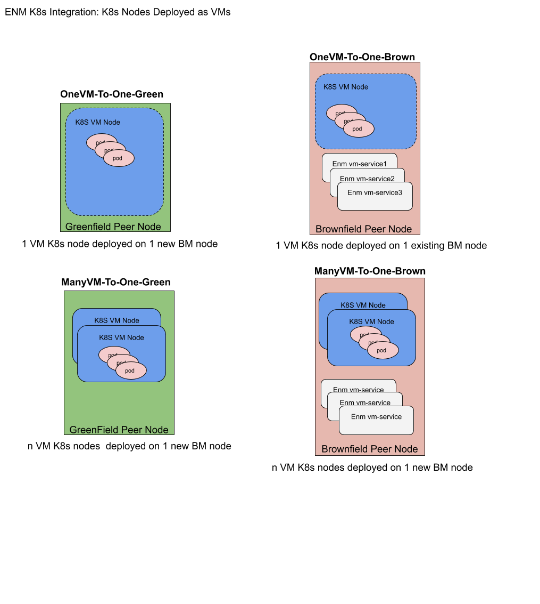
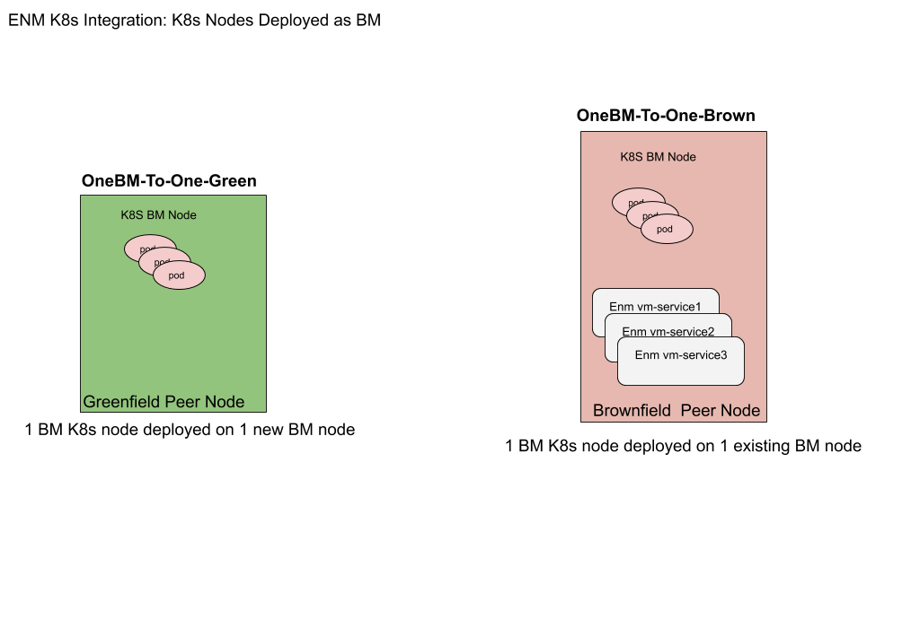
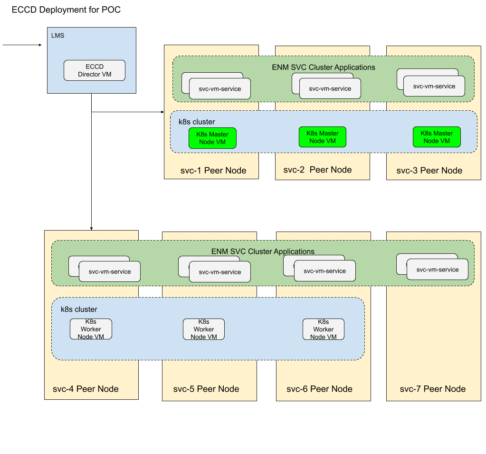
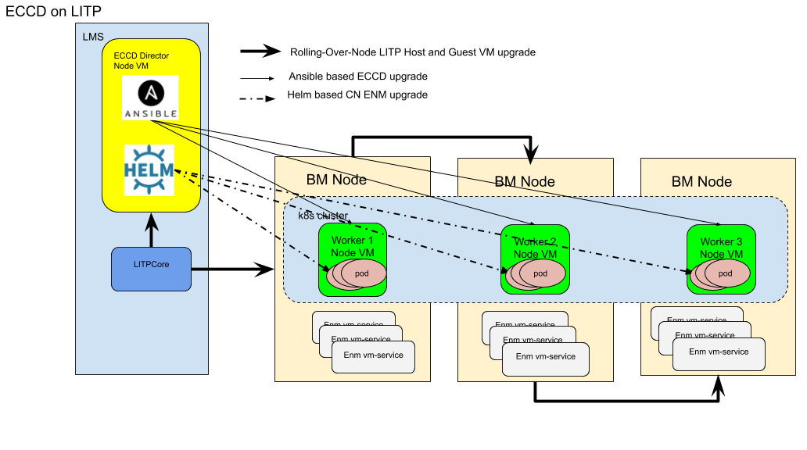
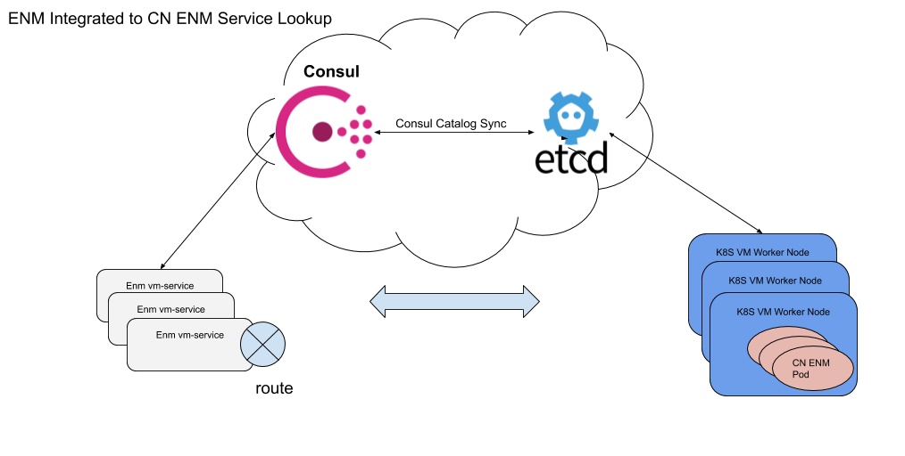
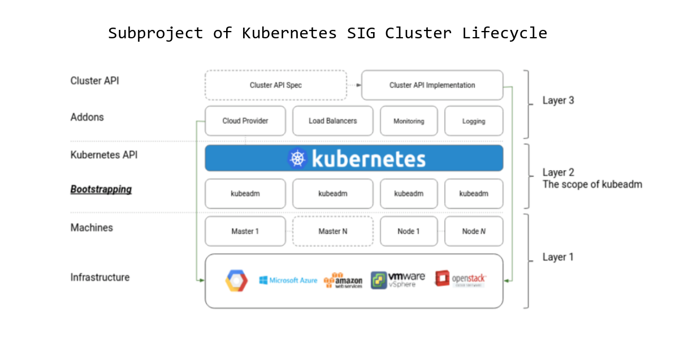
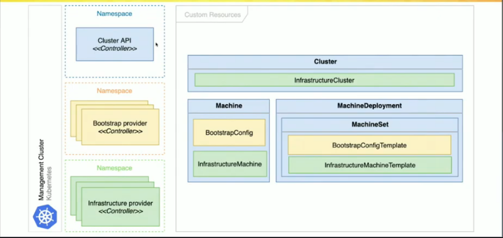

# Deployment of Kubernetes Environment on Integrated ENM

**Author(s)**
Tom Harris

[TOC]
# Introduction

## Revision History

| Name             | Number        | Version |Date |Author  | Comment |
| ---------------- | ------------- | ------- |--- |------- | ------- |
| ECCD on LITP POC | BDGS-xxx-yyyy | PA1     | 18/02/2020 |etomhar | Ready for review |
| ECCD on LITP POC | BDGS-xxx-yyyy | A     | 25/02/2020 |etomhar | All comments received |

## TA

| Title                                                                           | JIRA          | URL                                                                                         |
| ------------------------------------------------------------------------------- | ------------- | ------------------------------------------------------------------------------------------- |
| OEPTA_2019_258 Deployment of Kubernetes Environment on Integrated/Openstack ENM | OSSEPTAP-8834 | [OEPTA_2019_258](<https://jira-oss.seli.wh.rnd.internal.ericsson.com/browse/OSSEPTAP-8834>) |

## Acronyms and Explanations

| Acronym | Term                                  | Definition                                                                                            |
| :------ | :------------------------------------ | :---------------------------------------------------------------------------------------------------- |
| BM      | Bare Metal                            | A computer system without a base operating system (OS) or installed applications.                     |
| CN      | Cloud Native                          | Building and running applications that exploits the advantages of the cloud computing delivery model. |
| ECCD    | Ericsson Cloud Container Distribution | Integrated container orchestration and management solution based on Kubernetes.                       |
| IBD     | Image Based Deployment                | An Openstack based ECCD deployment                                                                    |
| K8s     | Kubernetes                            |                                                                                                       |
| LITP    | Linux IT Platform                     | IT platform layer of YMER/Common Architecture Framework for OSS.                                      |
| LMS     | LITP Management Server                | LITP Core and Plugin software that orchestrates the management of ENM deployment   |
| POC     | Proof Of Concept                      | |
| RHVH    | Red Hat Virtualization Host           |RHVH is a minimal operating system based on Red Hat Enterprise Linux that is designed to provide a simple method for setting up a physical machine to act as a hypervisor in a Red Hat Virtualization environment|
| VCS     | Veritas Cluster Server |
| VM      | Virtual Machine                        | |
| vENM    | Virtual ENM | Openstack based ENM Deployment|

## Abstract

A key enabler in the ENM CN vision will be to provide a clear deployment strategy for new software and a deprecation path for old software. The way to achieve this is to facilitate side by side deployment on the same platform/infrastructure by providing a K8s cluster on existing ENM infrastructure/deployments. This TA involves a POC to deploy ECCD to create a new K8s Environment on an Integrated LITP based Physical ENM Environment to facilitate a co-deployment of CN ENM.

## Scope

This document will describe the possible approaches to deploying an ECCD based Kubernetes Cluster on Integrated LITP based Physical ENM Environment.
It will cover the following topics.

1. Deployment Options
2. POC Description
3. ECCD Install
4. ECCD Upgrade
5. ENM Application Install/Upgrade
6. Cross Cluster Communication
7. Observations
8. Further Work

### Out of Scope

Co-deploying ECCD on an vENM (Openstack) deployment is not in scope for this document. To deploy ECCD on vENM a new set of workflows would be needed in conjunction with the IBD ECCD offering which is Openstack based. As is the case for ENM on Physical the Consul Sync solution would also be required to ensure cross-cluster service discovery. VIO based ENM is also out of scope.

## POC Software Baseline

| Technology    | Design Base                                            |
| :------------ | :----------------------------------------------------- |
| ENM           | ENM 19.17 (ISO Version: 1.84.113) AOM 901 151 R1DC     |
| ECCD          | eccd-2.3.0-137 CXP9036304R12A.tgz                      |
| Director qcow | eccd-2.3.0-137-cdaaee43-director-image.qcow2 (SLES 15) |
| Node qcow     | eccd-2.3.0-137-cdaaee43-node-image.qcow2 (SLES 15)     |

# Technical Solution

## Deployment Options

There are a number of possible deployment options available to get a working ECCD K8s Environment deployed on a LITP managed Physical ENM platform.

* The K8s nodes could be deployed as VMs or deployed as bare metal peer node hosts
* The K8s nodes can be deployed on new dedicated peer nodes (Greenfield - is not a realistic option for ENM as any deployment of K8S must fit within the existing hardware footprint) or co-locate on existing ENM peer nodes (Brownfield)
* If deployed as VMs, deploy in a one K8s VM node to one peer node ratio or many K8s VM nodes to one peer node ratio. (One-To-One or Many-To-One).

Any combination or the before mentioned is also possible once the required OS prerequisites are satisfied and the required deployment is declaratively modeled in LITP.

ECCD currently supports two deployment options

   1) IBD (An Openstack Image Based Deployment).
   2) A Pre-Provisioned VM deployment.

Both are delivered with an array of supporting bash scripts and ansible playbooks. There is also the concept of an ECCD Director node which essentially hosts the tools and clients (such as kubectl, Helm, and Ansible) that are necessary for management and orchestration of the K8s cluster.

### Minimum Resource Requirements per ECCD Node Type
Values taken form [Infrastructure Requirements Ericsson Cloud Container Distribution](http://cpistore.internal.ericsson.com/elex?LI=EN/LZN7920009/1*&FN=1_19202-HDA10371Uen.*.html&HT=ggv1525684641603})

| Node Type | Node Count | Node Architectutre |vCPU/CPU per Node. Overcommit is not recommended. | RAM per Node (GB) Overcommit is not recommended.  | storage (GB) |
| :---      | :---       | :--               | :---                                            | :---                                                     | :---         |
| Director  | 1          |  Physical machines on x86 architecture or VMs with virtualization support|2              | 4                 | 30           |
| Master    | 3          |  Physical machines on x86 architecture or VMs with virtualization support|2              | 4                 | 30           |
| worker    | 2          |  Physical machines on x86 architecture or VMs with virtualization support|2              | 4                 | 30           |

### ECCD Director

ECCD uses Ansible to orchestrate some stages of the install and upgrade of the K8s cluster (The IBD solution also uses bash scripts some of which are invoked via Heat Templates). Currently the LITP host OS, RHEL 6.10, does not support running ansible-playbooks as Python 2.7 is required (RHEL 6.10 has Python 2.6 by default). To facilitate Ansible the ECCD Director qcow was used to create an ECCD director VM on the LMS.

### ECCD K8s Nodes as VMs or Bare Metal Peer Nodes

K8s nodes can be deployed as VMs or as BM nodes. For the POC we choose to deploy the K8s nodes as VMs. It was convenient to use the qcow images delivered with ECCD as they have all the required OS addons pre-installed. However some thought needs to be given as to whether deploying as VMs is the preferred node deployment option. There are pros and cons to both i.e. deploying K8s nodes as VMs or as BM nodes.

#### K8s nodes deployed as VMs on BM peer node

| Pros | Cons |
| :--- | :--- |
| More flexible deployment options (could deploy multiple K8s nodes per LITP peer node)| |
| Better isolation, sandbox resources and security | |
| Support if using RHVH (cost permitting) | |
| Automatic K8s Node HA using VCS or puppet | |
| | VM reconstitution on HA events causes complications. K8s Node is blown away and new node needs to be reconfigured to rejoin the cluster|
| | For ECCD rolling upgrade, K8s node config needs to be persisted, brings machine immutability into question |

#### K8s nodes deployed as BM peer nodes

| Pros | Cons |
| :--- | :--- |
| No Virtualization Layer required. | |
| Better utilization of resources (No over-provisioned VMs).| |
| No VM reconstitution complications. | |
| For ECCD rollin upgrade there are no extra steps required for K8s config persistance.|
| | Co-deploying with ENM VMs on the same node requires “node-allocatable” to avoid K8s induced resource depletion.|
| | Docker and K8s binaries required on Host OS. |
| | Node immutability becomes more difficult. Difference between immutable VM and bare metal host |

### ECCD K8s VM Nodes to Bare Metal Peer Node Mapping

The following is a synopsis of deployment possibilities if K8s Nodes are deployed as VMs (Note greenfield options are not valid for ENM as any deployment of K8S must fit within the existing hardware footprint).

1. __OneVM-To-One-Green__: Deploy K8s nodes as VMs on a One-To-One ratio mapping on new dedicated greenfield bare metal peer nodes.
    This option involves the additional cost of new nodes.
2. __ManyVM-To-One-Green__: Deploy K8s nodes as VMs on a Many-To-One ratio on new dedicated greenfield bare metal peer nodes.
    This option involves (albeit less that the One-To-One-Green_VM) the additional cost new nodes. Also LITP Rolling-Over-Node host upgrade would involve the cordoning of multiple K8s nodes at a time making HA planning and deployment layout more complex.
3. __OneVM-To-One-Brown__: Deploy K8s nodes as VMs on a One-To-One ratio mapping on existing brownfield bare metal peer nodes.
    This option involves securing spare capacity on existing bare metal peer nodes.
4. __ManyVM-To-One-Brown__: Deploy K8s nodes as VMs on a Many-To-One ratio on existing dedicated brownfield bare metal peer nodes.
    This option involves securing spare capacity on existing bare metal peer nodes. Also LITP Rolling-Over-Node host upgrade would involve the cordoning of multiple K8s nodes at a time making HA planning and deployment layout more complex.



The following is a synopsis of deployment possibilities if K8s Nodes are deployed as BM nodes.

5. __OneBM-To-One-Green__: Deploy K8s nodes as bare metal nodes on a One-To-One ratio mapping on new dedicated greenfield bare metal peer nodes.
    This option involves the additional cost of new nodes.
6. __OneBM-To-One-Brown__: Deploy K8s nodes as bare metal nodes on a One-To-One ratio mapping on existing brownfield bare metal peer nodes.
    This option involves securing spare capacity on existing bare metal peer nodes.



## POC Description

For the POC the __One-To-One-Brown_VM__ option was chosen as this did not require any additional new nodes and LITP modeling was simplified.
The ECCD deployment was composed of one Director node deployed on the LMS, three K8s master nodes and three K8s worker nodes, all deployed on existing svc nodes.




### Deployment of ECCD Director

* Support for a new LITP Item Type __vm-zypper-repo__ was added to ERIClitplibvirtapi/ERIClitplibvirt to add cloud-init snippets to provision zypper repo client configuration. This was required to install package ERIClitpvmmonitord which is required to support vm customization script functionality and call the node healthcheck scripts.

* The eccd-2.3.0-137-cdaaee43-director-image.qcow2 image is in qcow V3 format. LITP only supports qcow V2 so the qcow needs to be converted to a V2 format.

```
qemu-img convert -f qcow2 ./eccd-2.3.0-137-cdaaee43-director-image.qcow2 -O qcow2 -o compat=0.10
```

* The Director qcow contains a pre-provisioned docker registry **rootDirectory** with the ECCD K8s container images for a specific ECCD release. These images need to be copied to a private registry (Air gapped) whose storage rootdirectory is persisted. This is required because once the Director VM is upgraded the old images and new images need to be available. The images are located in the following directory.


```
sles@ms-director:~> ls -ltra /var/lib/eccd/images/docker/registry/v2/repositories/
drwxr-xr-x  4 root root   39 Jul  5  2019 ..
drwxr-xr-x  5 root root   55 Jul  5  2019 alpine-util
drwxr-xr-x  5 root root   55 Jul  5  2019 kube-state-metrics
drwxr-xr-x  5 root root   55 Jul  5  2019 pm-server
drwxr-xr-x  5 root root   55 Jul  5  2019 node-exporter
drwxr-xr-x  5 root root   55 Jul  5  2019 alertmanager
drwxr-xr-x  5 root root   55 Jul  5  2019 configmap-reload
drwxr-xr-x  5 root root   55 Jul  5  2019 pushgateway
drwxr-xr-x  5 root root   55 Jul  5  2019 addon-resizer
drwxr-xr-x  5 root root   55 Jul  5  2019 metrics-server
drwxr-xr-x  5 root root   55 Jul  5  2019 calico_ctl
drwxr-xr-x  5 root root   55 Jul  5  2019 calico_kube-controllers
drwxr-xr-x  5 root root   55 Jul  5  2019 node
:
:
```

* A vm customization script was written to create a local docker registry on the Director VM with a persisted registry server rootDirectory (nfs share). The new images are then copied to the local registry on Director VM upgrade using the [skopeo copy](https://github.com/containers/skopeo) command. The registry cert and keys are also provisioned by this vm custom script.

The following directories on the Director Node were persisted on an nfs share.

```
    /etc/kubernetes
    /home/${ssh_user}/.kube
    /etc/sysconfig/SuSEfirewall2.d
    /etc/docker-distribution/registry
```

* The Director Image also contains the ECCD Ansible Playbooks that install/upgrade/uninstall ECCD for the pre-provisioned VM solution. The install.yml playbook was used for the ECCD install. The IBD install solution could not be used as the install is orchestrated via Heat Templates with cloud-init injection.

Example LITP commands to deploy the Director on the LMS, HA managed by puppet.


    litp create -t vm-image  -p /software/images/eccd-director-image
    -o source_uri=http://192.168.0.42/images/ECCD/eccd-2.3.0-137-cdaaee43-director-image.qcow2 name=eccd-director-image

    litp create -t vm-service -p /ms/services/eccd_director
    -o service_name=director ram=5120M cpus=4 internal_status_check=on image_name=eccd-director-image

    litp create -t vm-custom-script  -p /ms/services/eccd_director/vm_custom_script/customscript
    -o custom_script_names=director_customization.sh

    litp create -t vm-zypper-repo -p /ms/services/eccd_director/vm_zypper_repos/3pp
    -o name=3pp base_url=http://192.168.0.42/3pp

    litp create -t vm-package -p /ms/services/eccd_director/vm_packages/vmmonitord
    -o name=ERIClitpvmmonitord_CXP9031644

    vm_ssh_key = cat /root/.ssh/vm_private_key.pub

    litp create -t vm-ssh-key -p /ms/services/eccd_director/vm_ssh_keys/vm-ssh-key-id
    -o ssh_key=$vm_ssh_key

    litp create -t vm-network-interface -p /ms/services/eccd_director/vm_network_interfaces/internal
    -o host_device=br3 device_name=eth0 ipaddresses=10.247.246.95 network_name=internal

    litp create -t vm-network-interface -p /ms/services/eccd_director/vm_network_interfaces/services
    -o host_device=br0 device_name=eth1 ipaddresses=192.168.0.153 network_name=services

    litp create -t vm-network-interface -p /ms/services/eccd_director/vm_network_interfaces/storage
    -o host_device=br1 device_name=eth2 ipaddresses=172.16.30.207 network_name=storage

    litp create -t vm-alias -p /ms/services/eccd_director/vm_aliases/eccd_registry
    -o address=192.168.0.153 alias_names=eccd-registry


### Deployment of ECCD K8s Master Nodes

* The eccd-2.3.0-137-cdaaee43-node-image.qcow2 image is in qcow V3 format. LITP only supports qcow V2 so the qcow needs to be converted to a V2 format.

`qemu-img convert -f qcow2 ./eccd-2.3.0-137-cdaaee43-node-image.qcow2 -O qcow2 -o compat=0.10`

* The image also comes with SLES openstack zypper repo config pre-provisioned. These need to be disabled/removed.
* The image also has some openstack cloud config metadata that needs to be disabled.

During a LITP rolling over node upgrade the K8s master node VMs will be reconstituted and thus all K8s config needs to be persisted so that the node can leave and re-join the K8s cluster. A K8s Master VM customization script was written to facilitate this.
The following directories on the Master Node were persisted on an nfs share.

    /etc/etcd
    /etc/keepalived
    /etc/kubernetes
    /etc/haproxy
    /usr/local/lib/systemd/system
    /var/lib/kubelet/pki
    /var/lib/etcd
    /home/${ssh_user}/.kube
    /usr/local/etc/cni
    /usr/lib/etc/cni

The customization script also provisions the local docker registry cert as the master nodes need to pull the ECCD docker images for install and upgrade.

Example LITP commands to deploy the three K8s master nodes on the LITP peer nodes, HA managed by VCS, which is essentially a VCS Master Node Service Group.

    litp create -t vm-image  -p /software/images/eccd-node-image
    -o source_uri=http://192.168.0.42/images/ECCD/eccd-2.3.0-137-cdaaee43-node-image.qcow2 name=eccd-node-image

    litp create -t vm-service -p /software/services/eccd_master
    -o service_name=master ram=5120M cpus=4 internal_status_check=off image_name=eccd-node-image

    vm_ssh_key = cat /root/.ssh/vm_private_key.pub

    litp create -t vm-ssh-key -p /software/services/eccd_master/vm_ssh_keys/vm-ssh-key-id
    -o ssh_key=$vm_ssh_key

    litp create -t vm-network-interface -p /software/services/eccd_master/vm_network_interfaces/internal
    -o host_device=br3 device_name=eth0 ipaddresses=10.247.246.214,10.247.246.215,10.247.246.121 network_name=internal

    litp create -t vm-network-interface -p /software/services/eccd_master/vm_network_interfaces/services
    -o host_device=br0 device_name=eth1 ipaddresses=192.168.0.164,192.168.0.165,192.168.0.124 network_name=services

    litp create -t vm-network-interface -p /software/services/eccd_master/vm_network_interfaces/storage
    -o host_device=br2 device_name=eth2 ipaddresses=172.16.30.135,172.16.30.136,172.16.30.138 network_name=storage

    litp create -t vm-package -p /software/services/eccd_master/vm_packages/ERIClitpvmmonitord
    -o name=ERIClitpvmmonitord_CXP9031644

    litp create -t vm-zypper-repo -p /software/services/eccd_master/vm_zypper_repos/3pp
    -o name=3pp base_url=http://192.168.0.42/3pp

    litp create -t vm-custom-script  -p /software/services/eccd_master/vm_custom_script/customscript
    -o custom_script_names=master_customization.sh

    litp create -t vm-alias -p /software/services/eccd_master/vm_aliases/eccd_registry
     -o address=192.168.0.153 alias_names=eccd-registry

    litp create -t vcs-clustered-service -p /deployments/enm/clusters/svc_cluster/services/eccd_master
    -o name=master active=3 standby=0 node_list=svc-1,svc-2,svc-3|

### Deployment of ECCD K8s Worker Nodes

* The same eccd-2.3.0-137-cdaaee43-node-image.qcow2 image is used for the K8s worker nodes and same adjustments as above are required.

During a LITP rolling over node upgrade the K8s worker node VM will be reconstituted and thus all K8s config needs to be recovered. In ECCD IBD solution the K8s config is fetched from the first master node using an ansible playbook. Once the config is in place a kubeadm join can be initiated to allow the upgraded worker node rejoin the K8s cluster. The following files are fetched.

    /etc/kubernetes/admin.conf
    /etc/kubernetes/kubeadm-config.yaml

The customization script also provisions the local docker registry cert.

Example LITP commands to deploy the three K8s worker nodes on the Peer Nodes, HA managed by VCS,  which is essentially a VCS Worker Node Service Group

    litp create -t vm-image  -p /software/images/eccd-node-image
    -o source_uri=http://192.168.0.42/images/ECCD/eccd-2.3.0-137-cdaaee43-node-image.qcow2 name=eccd-node-image

    litp create -t vm-service -p /software/services/eccd_worker
    -o service_name=worker ram=5120M cpus=4 internal_status_check=off image_name=eccd-node-image

    vm_ssh_key = cat /root/.ssh/vm_private_key.pub

    litp create -t vm-ssh-key -p /software/services/eccd_worker/vm_ssh_keys/vm-ssh-key-id -o ssh_key="$vm_ssh_key"

    litp create -t vm-network-interface -p /software/services/eccd_worker/vm_network_interfaces/internal
    -o host_device=br3 device_name=eth0 ipaddresses=10.247.246.102,10.247.246.109,10.247.246.233 network_name=internal

    litp create -t vm-network-interface -p /software/services/eccd_worker/vm_network_interfaces/services
    -o host_device=br0 device_name=eth1 ipaddresses=192.168.0.128,192.168.0.135,192.168.0.127 network_name=services

    litp create -t vm-network-interface -p /software/services/eccd_worker/vm_network_interfaces/storage
    -o host_device=br2 device_name=eth2 ipaddresses=172.16.30.211,172.16.30.216,172.16.30.130 network_name=storage

    litp create -t vm-package -p /software/services/eccd_worker/vm_packages/ERIClitpvmmonitord
    -o name=ERIClitpvmmonitord_CXP9031644
   
    litp create -t vm-zypper-repo -p /software/services/eccd_worker/vm_zypper_repos/3pp
    -o name=3pp base_url=http://192.168.0.42/3pp

    litp create -t vm-custom-script  -p /software/services/eccd_worker/vm_custom_script/customscript
    -o custom_script_names="worker_customization.sh"

    litp create -t vm-alias -p /software/services/eccd_worker/vm_aliases/eccd_registry
    -o address=192.168.0.153 alias_names=eccd-registry

    litp create -t vcs-clustered-service -p /deployments/enm/clusters/svc_cluster/services/eccd_worker
    -o name=master active=3 standby=0 node_list="svc-4,svc-5,svc-6"

---

## ECCD install

The existing LITP ERIClitplibvirt plugin will generate the tasks to deploy and upgrade the Director and ECCD K8s node VMs.

For initial install, once the LITP plan tasks to provision the Director VM, K8s master VMs and K8s worker VMs are successful (ERIClitplibvirt & ERIClitpvcs plugins) the ECCD install.yml ansible playbook needs to be invoked from the Director VM.


The ansible playbooks are currently delivered as part of the ECCD Director qcow image.
A K8s LITP plugin (ERIClitpK8s) needs to schedule tasks to create the required ansible inventory and group_vars files and invoke the appropriate ansible playbook on the Director VM.

The LITP modeling proposal is to introduce a new Model Item k8s-vm-service which extends the vm-service Item Type. This new Item Type would contain an role attribute which would indicate which role within the ECCD K8s cluster the VM will assume  i.e. a K8s Director Node, a K8s Master Node or a K8S Worker Node.

            property_types.append(PropertyType("k8s_provider",
                    regex=r"^(eccd|kind)$"),)
            property_types.append(PropertyType("k8s_role",
                    regex=r"^(director|master|worker)$"),)`


            ItemType("k8s-vm-service",
                    extend_item='vm-service',
                    item_description="K8s service",
                    provider=Property("k8s_provider",
                                prop_description="K8s Provider",
                                default="eccd",
                                required=True),
                    **role**=Property("k8s_role",
                                prop_description="K8s Role",
                                required=True),)

The ERIClitpK8s plugin should query the k8s-vm-services Item Types and generate the required LITP Plan Tasks. Additional Item Type properties can be introduced to configure the required Ansible group_vars required e.g **calico_ipv4pool_cidr**, **docker_registry_host** and **helm_chart_loc_override**

Plugin Tasks required

* Install:
  * CLUSTER Phase
    * Create inventory and group_vars file for Initial Install of ECCD
    * Copy Inventory file to ${ANSIBLE_INVENTORY} directory on Director
    * Invoke/monitor "ansible-playbook install.yml" from Director

## ECCD upgrade

To maintain availability a Rolling-Over-Node upgrade LITP plan will be used for ECCD upgrade. ERIClitpvcs plugin will generate Node Lock/Unlock tasks, while the ERIClitplibvirt will generate the required VM upgrade tasks. If the Director VM is deployed on the LMS no Node Lock/Unlock tasks will be generated for its upgrade.

PRE_NODE_LOCK and POST_NODE_UNLOCK tasks are required for K8s Master VMs and K8s Worker VMs to facilitate K8s drain/delete/upgrade/join functionality that is **partly** provided by the current ECCD ansible upgrade  playbooks.


Plugin Tasks required

* Rolling-Over-Node for Master Upgrade:
  * PRE_NODE_LOCK_GROUP LITP Plan Phase
    * Create inventory and group_vars file for k8s master node upgrade
    * Copy Inventory file to ${ANSIBLE_INVENTORY} directory on Director VM
    * optional Invoke/monitor "ansible-playbook drain_master_node.yml"
    * Invoke/Monitor "ansible-playbook delete_master_node.yml"

  * POST_NODE_LOCK_GROUP LITP Plan Phase
    * Create inventory and group_vars file for K8s master node upgrade
    * Copy Inventory file to ${ANSIBLE_INVENTORY} directory on Director VM
    * Invoke/Monitor "ansible-playbook  upgrade_rejoin_master.yml"

* Rolling-Over-Node for Worker Upgrade:
  * PRE_NODE_LOCK_GROUP LITP Plan Phase
    * Create inventory and group_vars file for node upgrade
    * Copy Inventory file to ${ANSIBLE_INVENTORY} directory on Director
    * Invoke/Monitor "ansible-playbook drain_worker_node.yml"
    * Invoke/Monitor "ansible-playbook delete_worker_node.yml"

  * POST_NODE_LOCK_GROUP LITP Plan Phase
    * Create inventory and group_vars file for node upgrade
    * Copy Inventory file to ${ANSIBLE_INVENTORY} directory on Director
    * Invoke/Monitor "ansible-playbook  upgrade_rejoin_worker.yml"

Example inventory file
```
                node1 ansible_host=192.168.0.243
                node2 ansible_host=192.168.0.244
                node3 ansible_host=192.168.0.245
                node4 ansible_host=192.168.0.166
                node5 ansible_host=192.168.0.167
                node6 ansible_host=192.168.0.168
                [etcd]
                node1
                node2
                node3
                [master]
                node1
                node2
                node3
                [worker]
                node4
                node5
                node6
```

Example group_vars/all for ECCD

```
            calico_ipv4pool_cidr: "10.1.0.0/16"
            docker_registry_host: "myregistry:5000"
            setup_chrony: true
            chrony_config_server:['0.pool.ntp.org','1.pool.ntp.org'
                                   2.pool.ntp.org','3.pool.ntp.org']
```

## ENM Application Install/Upgrade

Cloud Native ENM application install and upgrade will be orchestrated via Helm charts. The CN ENM artifacts involve a CSAR
which is composed of

* Helm Charts
* Docker images
* Site Engineering File (integration values.yaml)

A new LITP command import_csar (equivalent to litp import_iso) could be utilized to orchestrate the CSAR download and image registry update.

The helm install/upgrade may also be orchestrated by LITP via a plugin generating tasks which invoke the required helm commands on the Director node (Director already has a helm client installed). The same local ECCD Docker Registry could be reused for CN ENM images.

CN ENM application install/upgrade tasks/commands must be scheduled and executed post ECCD install/upgrade i.e. on a stable K8s cluster and not dovetailed during the K8s node install /Rolling-Over-Node upgrade.
This means that for the upgrade use case the CN ENM applications will be upgraded later than Integrated ENM based applications in either a POST_CLUSTER_GROUP LITP Plan Phase or via a separate Helm orchestration flow/plan that could be run independently.



## Cross cluster communication

Existing vm-services in Integrated ENM and K8s based CN ENM services will need to discover and communicate with each other. IP allocation is static for ENM Integrated services but dynamic in CN ENM, therefore some form of service registration/discovery is required for ENM vm-services in Integrated ENM.
It is proposed to use consul as a service registry for vm-services in Integrated ENM. The ERIClitplibvirt plugin could be extended to bootstrap the already installed consul agent and provide a generic cloud-init **runcmd** implementation for service registry, similar to what has already been implemented in vENM.

Example implementation of consul agent bootstrap for ERIClitplibvirt

'''

    def _get_write_files(self):

        write_files = []

        consul_config_template_content = \
        "\t{\n" + \
        "\t\"bind_addr\": \"0.0.0.0\",\n" + \
        "\t\"advertise_addr\": \"SERVICE_ADDRESS\",\n" + \
        "\t\"node_name\": \"SERVICE_NAME\",\n" + \
        "\t\"server\": false,\n" + \
        "\t\"datacenter\": \"dc1\",\n" + \
        "\t\"data_dir\": \"/ericsson/consul\",\n" + \
        "\t\"disable_remote_exec\": true,\n" + \
        "\t\"log_level\": \"INFO\",\n" + \
        "\t\"enable_syslog\": true,\n" + \
        "\t\"enable_script_checks\": false,\n" + \
        "\t\"domain\": \"enm\",\n" + \
        "\t\"ports\":{\n" + \
        "\t\t\"dns\": 8600\n" + \
        "\t\t},\n" + \
        "\t\"dns_config\":{\n" + \
        "\t\t\"only_passing\": true\n" + \
        "\t\t},\n" + \
        "\t\"raft_protocol\": 5,\n" + \
        "\t\"retry_join\": [\"CONSUL_ADDRESSES\"],\n" + \
        "\t\"rejoin_after_leave\": true,\n" + \
        "\t\"leave_on_terminate\": false,\n" + \
        "\t\"disable_update_check\": true,\n" + \
        "\t\"client_addr\": \"0.0.0.0\"\n" + \
        "\t}"

        consul_config_template = {'path': '/run/cloud-init/config_template_consul.json',
                         'owner': 'root:root',
                         'permissions': '0644',
                         'encoding': 'b64',
                         'content': standard_b64encode(consul_config_template_content)}

        write_files.append(consul_config_template)

        generate_consul_config_content = \
        "     #!/bin/bash \n" + \
        "     CP=/bin/cp \n" + \
        "     MV=/bin/mv \n" + \
        "     CHMOD=/bin/chmod \n" + \
        "     SED=/bin/sed \n" + \
        "     MKDIR=/bin/mkdir\n" + \
        "\n" + \
        "     CONFIG_CONSUL_FILE=\"/etc/consul.d/agent/config.json\"\n" + \
        "     CONSUL_ADDRESSES=`cat /ericsson/tor/data/global.properties " + \
        ' |grep consul | awk -F"=" \'{print $2 }\' | sed \'s/,/","/g\'\`n' + \
        "\n" + \
        "     HOSTNAME=`hostname`\n" + \
        "     SERVICE_ADDRESS=`cat /etc/hosts |grep $HOSTNAME | awk -F\" \" \'{print $1 }\'`\n" + \
        "     SERVICE_NAME=`cat /etc/hosts |grep $HOSTNAME | awk -F\" \" '{print $2 }'`\n" + \
        "\n" + \
        "     $MKDIR -p /etc/consul.d/agent \n" + \
        "     $CHMOD 755 /etc/consul.d/agent\n" + \
        "\n" + \
        "     $CP /run/cloud-init/config_template_consul.json $CONFIG_CONSUL_FILE\n" + \
        "\n" + \
        "     echo \"CONSUL_ADDRESS = $CONSUL_ADDRESSES\"\n" + \
        "     echo \"SERVICE_NAME = $SERVICE_NAME\"\n" + \
        "     echo \"SERVICE_ADDRESS  = $SERVICE_ADDRESS\"\n" + \
        "\n" + \
        "     sed -i \"s/CONSUL_ADDRESSES/\"$CONSUL_ADDRESSES\"/g\" $CONFIG_CONSUL_FILE\n" + \
        "     sed -i \"s/SERVICE_NAME/\"$SERVICE_NAME\"/g\" $CONFIG_CONSUL_FILE\n" + \
        "     sed -i \"s/SERVICE_ADDRESS/\"$SERVICE_ADDRESS\"/g\" $CONFIG_CONSUL_FILE\n"

        generate_consul_config = {'path': '/run/cloud-init/generateConsulConfig.sh',
                        'owner': 'root:root',
                        'permissions': '0755',
                        'encoding': 'b64',
                        'content': standard_b64encode(generate_consul_config_content)}

        write_files.append(generate_consul_config)

        consul_start_content = \
        "    #!/bin/bash \n" + \
        "    LOG_TAG=\"START-SERVICEREGISTRY-$(hostname -s)\" \n" + \
        "    if [ $(/sbin/pidof systemd) ] ; then \n" + \
        "        systemctl enable consul.service \n" + \
        "        systemctl start consul.service \n" + \
        "    elif [ $(/sbin/pidof init) ] ; then \n" + \
        "        chkconfig --add consul \n" + \
        "        service consul start \n " +\
        "    else \n" + \
        "         error \"Failed to find any services system.\" \n" + \
        "    fi \n"

        consul_start = {'path': '/run/cloud-init/consul_start.sh',
                        'owner': 'root:root',
                        'permissions': '0755',
                        'encoding': 'b64',
                        'content': standard_b64encode(generate_consul_config_content)}

        write_files.append(consul_start)
        return write_files

'''

The services registered in Kubernetes and Consul can be automatically synced so that Kubernetes services are available to Consul agents and services in Consul can be available as first-class Kubernetes services. This functionality is provided by the [consul-k8s](https://github.com/hashicorp/consul-k8s) project and can be automatically installed and configured using the Consul Helm chart.
See <https://www.consul.io/docs/platform/k8s/service-sync.html>

Internal networking routes must also be setup to allow communication.
This area of cross-cluster communication may need further investigation depending on the communication protocols required. The consul-k8s solution would need to be POCed.



## Observations

1. ### Security

   The POC utilized the LITP vm-custom-script functionality to provision ansible ssh keys and docker registry certs. In production a more secure mechanism would need to be implemented to provisions these artifacts (perhaps the ERIClitplibvirt plugin could be expanded so that these artifacts could be provisioned via cloud-init).
   Also some thought needs to be given on how to trigger the Ansible scripts from the Director node. LITP CallBack Tasks could utilise Paramiko to ssh onto the Director and invoke and monitor the ansible playbooks. The ssh keys could be pre-provisioned in LITP crypt.

2. ### The VM reconstitution problem

    The VCS HA-Manager's clean command for current vm-services "cleanup_command: /sbin/service *service_name* stop-undefine --stop-timeout=45" results in a possible reconstitution/undefining of the VM on any HA event, not just upgrade. The Kubernetes node-controller only ensures "eventual consistency". It will detect and evict pods from a faulty node but there is no automatic K8s node recovery functionality. Consideration should be given to the idea of just reconstituting the K8s VMs on upgrade.

3. ### Multiple Layers of Orchestration

    There would now be essentially two layers of upgrade orchestration.

    * Rolling-Over-Node to upgrade host os, Director, K8s Master and K8s Worker nodes.
    * Cloud Native ENM application upgrade via helm.

    The fact that the CN ENM services will not be upgraded in tandem with Integrated ENM vm-services is a change in behavior from standard ENM upgrade. However these separate distinct upgrade phases may prove advantageous when it comes to migrating workloads from ENM vm-services to CN ENM containers.

4. ### ECCD Requirements

    For a LITP Rolling-Over-Node upgrade ECCD needs to support drain, delete, upgrade and rejoin of a kubernetes node. A mentioned previously ECCD deliver two deployment options

   1) IBD (Openstack Image Based Deployment).
   2) A Pre-Provisioned VM deployment.

    Both come with supporting Bash and Ansible Playbooks but neither meet the LITP Rolling-Over-Node requirements fully. The pre-provisioned VM delivered install.yml playbook is a good fit for our install use case, however the upgrade.yml or scale-in.yml are not LITP Node Lock friendly as they dont assume VM reconstitution.
    The IBD upgrade.yml playbook functionality is a near fit with probably most of the required functionality available, but it has Openstack dependencies built in and functionality is splintered between bash scripts and ansible playbooks. There is limited task tagging in the ansible-playbooks to allow selective task execution and the playbooks, in general are not idempotent, which is a fundamental architectural requirement for LITP plan tasks. Some work would need to be done to restructure and provide a concise set of playbooks that could be utilized by the proposed new ERIClitpk8s plugin.

    Also a qcow V2 image would be required and some baked in Openstack related cloud-init metadata and zypper repo config would need to be removed.

5. ### Single Lock/Unlock Task Pair

    Currently in LITP only one Lock/Unlock task pair is allowed per node, so if ECCD K8s nodes were deployed alongside ENM vcs-clustered-services then only the Lock/Unlock task pair from ERIClitpvcs plugin would be allowed. Its concievable that leaving and rejoining the K8s cluster could be contained within Node Lock/Unlock tasks. New functionality in LITP Core to allow multiple ordered Lock/Unlock tasks per node would need to be considered.
    Alternatively Pre-Node-Lock and Post-Node-Unlock LITP Plan Phases may facilitate the K8s delete / K8s re-join trigger points.

    An example LITP plan snippet could be as follows.

```
     * Task: Upgrade ECCD Director Node with new ECCD release.
     * Task: CallbackTask to invoke: ansible-playbook drain_node.yml
     * Task: CallbackTask to invoke: ansible-playbook delete_node.yml

       * Task: Lock svc-1
       * Task: Update packages on node "svc-1"
       * Task: Copy VM image file
       * Task: Copy VM cloud init userdata file to node
       * Task: Copy VM config file to node
       * Task: Remove instance directory
       * Task: Remove VM image file
       * Task: Unlock svc-1

     * Task: CallbackTask to invoke: ansible-playbook upgrade.yml
     * Task: CallbackTask to invoke: ansible-playbook rejoin.yml
```

1. ### Storage

   Storage Configuration was not in scope for the POC. If pod persistence is required its likely K8s hostPath or nfs volume types would be the simplest configuration.

1. ### Backup / Restore / Snapshot / Rollback

    The ECCD VM will be treated as regular vm-service VMs and so the existing procedure for snapshot and rollback should work as normal.
    Similarly the backup and restore procedure for ECCD VM persisted data will be consistent with the existing ENM Integrated solution.

    The same procedures should hold for CN ENM persisted data if hostPath or nfs volume types are used.

1. ### Kubernetes deployed on VMs or Bare Metal

    To utilize existing hardware we can overlay existing underutilized ENM nodes with ECCD. Some thought needs to be given as to whether K8S is deployed within VMs or directly on the bare metal nodes.
    Deploying on VMs allows for better isolation and more flexible deployment options in that we dont have to map a K8S node directly to a bare metal node.
    However deploying directly on bare metal allows us to remove the virtualization layer, removes the VCS ha-manager layer and allows for more dynamic resource utilization of node resources (no VM hard limits).

    Running k8s on bare metal nodes which also have ENM vm-service VMs provisioned can lead to resource contention.
    If ENM VMs are already up then k8s scheduler will just use the remaining resources left. However if the ENM VMs restart or start later, the K8s scheduler may have allocated all the resources and then the ENM VMs may not start.
    The kubelet exposes a feature named [Node Allocatable](https://kubernetes.io/docs/tasks/administer-cluster/reserve-compute-resources/#node-allocatable) that helps to reserve compute resources on a system.


# Strategic Consideration

## Strategic approach

* Converge to unified infrastructure.
* ENM Cloud Native and ENM Physical deployments can co-exist on the same infrastructure.
* Unified infrastructure should be easier to maintain, operate and reduce cost.
* Separate upgrade phases for Integrated and CN ENM should allow for easier migration of stateless workloads from VMs to Containers running on same infrastructure.
* Is there an immediate need to migrate stateful services to containers if they can be co-deployed on ENM Integrated DB cluster.

## Running K8s containers on Baremetal or VMs

The authors opinion is that the preferred deployment mechanism is to deploy K8s nodes as VMs thus utilizing the the ECCD delivered qcow artifacts.
Immutability of K8s nodes when deployed as VMs seems more achievable than immutable baremetal nodes. The extra “node-allocatable” config to co-deploy on LITP baremetal would not be required for CN ENM on public cloud. There is already an inbuilt Libvirt plugin and VCS based VM HA solution in LITP which can be leveraged for K8s node lifecycle management. Deploying K8s nodes on VMs also allows for more flexible deployments.
However deploying K8s nodes on baremetal may be required based on the requirements and characteristics of the application workloads being deployed.

# Summary of Requirement

N/A

# Benefit and Value of feature

N/A

# Technical Debt/Improvements considered

N/A

# Alternative Approaches Considered

N/A

# Input for further studies
K8s SIG Cluster Lifecycle's objective is to simplify creation, configuration, upgrade, downgrade and teardown of Kubernetes clusters and their components. This would alleviate the need for the ECCD Director Nodes and the majority of the Ansible Playbooks. The SIGs goal is to strive for simple declarative API-driven K8s cluster deployments so the same primitives, practices and processes used internally for pods in K8S can be applied to the lifcycle of all K8s custers irrespective which infrastructure they are deployed on and make K8s cluster install and upgrade as ubiquitous as application pod install and upgrade. The concept and feasability of a LITP based Cluster API Infrastructure Provider should be explored.

There is also merit in investigating whether K8s Cluster API can be utilized to HA existing ENM vm-services (VCS replacement). There are a number of K8S addons that may facilitate this requirement. Initial thoughts were that the Cluster API Machine controller could be utilized as a HA manager of ENM vm-services, whereby the VMs would be treated as K8s worker nodes, with an implementation of the Machine Health Checking Proposal a.k.a K8s node auto repair providing the required HA functionality.
Other K8s addons including [Kubevirt](https://kubevirt.io) and [Virtlet](https://docs.virtlet.cloud/) which treat VMs more akin to first-class citizen k8S workloads (i.e. treat VMs like pods rather that K8s nodes) should also be evaluated.



## Cluster API's Declarative Model



# Costs

Cost in team sprints

| Description                                             | Cost | Comment                                 |
| ------------------------------------------------------- | ---- | --------------------------------------- |
| LITP ERIClitpK8s Plugin                                 | 3    | Depends on ansible-playbook restructure (required to provision K8s Cluster API bootstrap control plane)|
| LITP Core New Plan Phases                               | 1    |                                         |
| Director customizations                                 | 1    |                                         (required to provision K8s Cluster API if using ECCD k8s images)|
| Master/Worker customizations                            | 1    |                                         (required to provision K8s Cluster API bootstrap control node if not using minkube)|
| ECCD Qcow Changes                                       | 1    | To be costed by ECCD ..?                (required to provision K8s Cluster API bootstrap control node if not using minkube)|
| ECCD ansible-playbook restructure                       | 3    | To be costed by ECCD ..?                (partly required to provision K8s Cluster API bootstrap control node if not using minkube)|
| ENM vm-service registry/lookup                          | 2    | centrally changed in ERIClitplibvirt    |
| Deploy Consul catalog sync                              | 2    |                                         |
| Documentation updates                                   | 2    |                                         |
| CN ENM CSAR import + registry update (litp import_csar) | ?    | EPIC 1 [Initial Install, Product and Application CSAR structure, Software Delivery](https://erilink.ericsson.se/eridoc/erl/objectId/09004cffc2d3ecad?docno=BDGS-19:006499Uen&action=current&format=msw12) 12 Person Sprint|
| CN ENM Helm Install/Upgrade orchestration plugin | 2   | Without Helm integration chart i.e. Helm command for each application chart |
