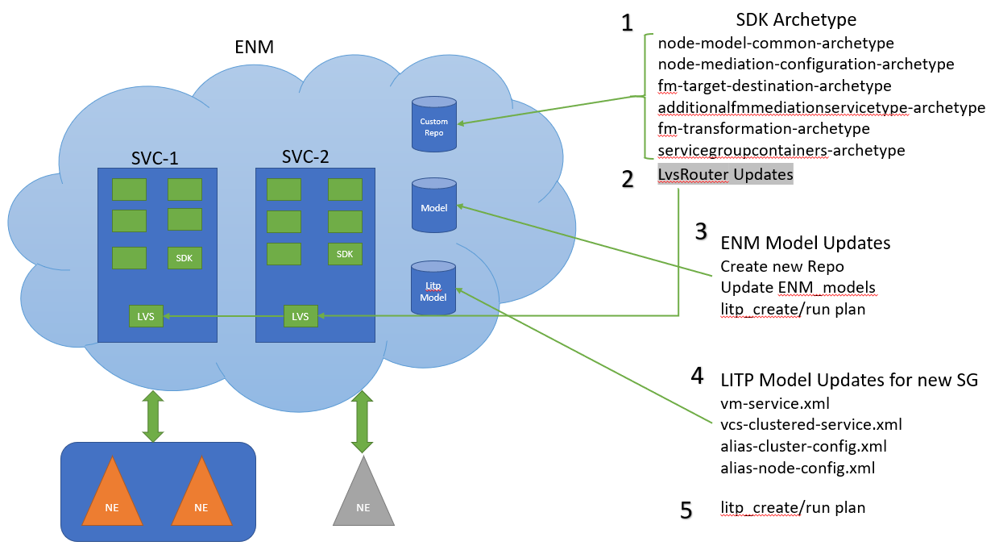
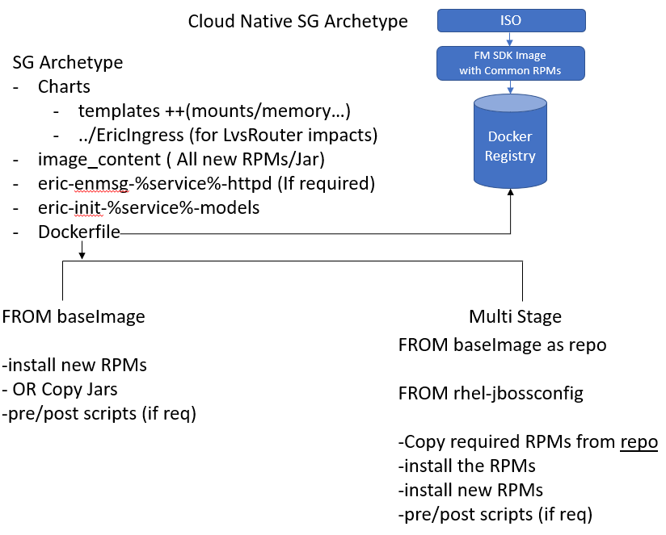
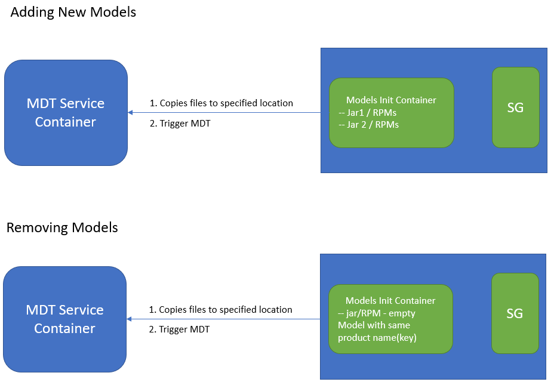

-- --

-- --

# Cloud-native ENM SDK

**Author(s)**  Atin Kohli


Keyword(s)

## Abstract

This study investigates proposal for FM/PM SG SDK in cENM.


[TOC]


#  Introduction

## Document Revision Information

| **Revision** | **Prepared** | **Date**   | **Comment**                                       |
| ------------ | ------------ | ---------- | ------------------------------------------------- |
| PA1          | ekohati      | 2020-02-10 | First draft after initial presentation with team. |
| PA2          | ekohati      | 2020-02-10 | Incorporated gerrit review comment                |
| A            | ekohati      | 2020-03-13 | Setting to Full revision.                         |


## Main Requirements

### MR-61022 Cloud-native ENM SDK

Text

SDKs must be provided to enable customizations of cloud-native ENM Applications.

Functional parity is required with the SDKs for Integrated ENM - i.e. FM and PM at a minimum.


## Purpose

The purpose of this study is to provide SDKs for FM & PM, to support SNMP Network Elements that are not currently managed by cENM.


## Scope

MR-61022

Identify the solution to produce SDKs for FM & PM to support NEs not supported by cENM, this includes the set of archetypes required for FM/PM components and the SDK images. This study should also provide proposal on how this would be delivered and integrated into customers environment independent of the cENM lifecycle.


## Out of Scope


- TR writing guidelines for FM/PM SDK.


## Open Issues

- 


## Decision Log

| **Responsible**  | **Description**                                                                     | **Date**       |
| :--------------- | :---------------------------------------------------------------------------------- | :------------- |
| *EMARENR*        | *FM SDK do not store any item(s) on the shared file system and have no content to be backed up before upgrade.* | *12-Feb-2020* |
| *EEIMHO*         | *PM SDK do not store any item(s) on the shared file system and have no content to be backed up before upgrade.* | *17-Feb-2020* |
|                  | Decided over email that FM/PM SDK images will have their own CXP numbers. | 11-Mar-2020 |

## Assumptions

-   Customer unit will have access to customer's docker registry to push & pull images.

- Except the ServicegroupContainer Archetype, all other archetypes could be used as it is for cENM.

## Dependencies

- The current solution is dependent on the new Model Service solution for cloud. For this study we need that the solution provided by the new model service gives us the flexibility to deploy models in cENM at runtime, which are introduced by the new PM/FM SDK containers. The solution is currently in progress, so this work needs to be completed after the final model service solution is available. However, it looks like the solution will be in line with the requirements of this study. 

# Overview of Problem


## FM/PM SDK support missing in cENM

Today, cENM (Cloud Ericsson Network Manager) delivers fault and performance management solutions which provide support for multiple Network Element types. However, pENM & vENM also provides the functionality via FM/PM SDK to manage custom SNMP Network Elements which are not supported by default. Current, cENM solution does not provide the same functionality to manage such Network Elements.


# Current solution

## Overview of the current solution for FM / PM SDK

The current solution for FM/PM SDK in ENM & vENM is well documented under the following documents:

-   ENM FM Customization for SNMP Network Elements [Appendix 1]
-   ENM PM Customization for SNMP Network Elements [Appendix 2]

However, here we will provide brief overview of the solution for the user to get an idea of the overall picture. To understand it in detail, please go through the above documents in calstore.



​                                                                Fig 1: FM SDK

### SDK Archetype

Currently, we provide SDK archetypes to build the projects needed for completely managing a new network element type. The SDK Archetype contains all archetypes needed to generate configuration files, handlers, and flows to manage new node type that has to be introduced in ENM/vENM.

All the RPMs produced by the archetypes are added to the custom yum repo. SG Container archetype also refers to the list of common RPMs like dpsclient, pib, sfwk ...etc, which would be picked from the existing ENM Yum Repos, during VM creation.

### LVS Router Impacts

LVS Router, provides a solution for creating custom rules. As part of the post-install script of the SG RPM, the new rules file is passed on to the LvsRouter, after making the required updates to the rules. The rules can also be updated at runtime.

### ENM Model Impacts

Once all the RPMs are prepared and available. The new models are added to the deployment, by introducing new model packages via litp command. Once the model packages are updated, litp create\_plan/run\_plan will load the new models into the system.

### LITP Model impacts for new SG

Templates of xml/yaml to update litp model/openstack deployment are provided in the document for ENM & vENM. Once these xml/yaml files are prepared after adding the correct configuration required for the new SDK SG, they are used to update the respective deployment to introduce the new SG.

Litp create/run plan will read the new litp model and provision the new SDK SG for ENM.  Similar functionality to provision the SG in vENM is also available. Hence the support to the new NE type will be available.


# Feature / System Impact

## SDK

As part of the solution for cloud Native ENM, we will be reusing some of the existing archetypes:

-   node-model-common-archetype

-   node-mediation-configuration-archetype

-   fm-target-destination-archetype

-   additionalfmmediationservicetype-archetype

-   fm-transformation-archetype

However, we will provide a new solution for the impacts on the following:

-   Servicegroupcontainers Archetype
-   LVS Router impacts
-   New Models introduction
-   Configuration of new Container
-   Install/upgrade of the SDK SG

The above impacts can be covered by the new cloud native service group container archetype & the FM/PM SDK Image. The diagram below shows the structure of the new cloud native archetype and other components involved to achieve the same.



​                                                              Fig 2: SDK SG Archetype

### FM/PM SDK Image

The FM/PM SDK images will be built as part of our regular pipeline and will contain the common set of RPMs required to the create the specific customized SDK container. The set of common RPMs required can be found from the current FM/PM SG SDK archetype from the following repo:

[OSS/com.ericsson.oss.mediation.sdk/sdk-archetypes](<https://gerrit.ericsson.se/#/admin/projects/OSS/com.ericsson.oss.mediation.sdk/sdk-archetypes>)

When building the SDK image, we should re-analyze if all the common RPMs mentioned in the pom file are still applicable to our cloud native ENM solution, at the time of implementation. These images will be built from either or all of the following base images eric-enm-rhel-jbossconfig or eric-enm-sles-eap6 or eric-enm-sles-eap7 to support the existing deployments.

As part of this task the pipeline needs to be updated so that it would build the new FM/PM SDK images as part of the nightly builds.

These images will be packed in a separate CSAR and delivered if requested. This will help us keep the size of current cENM CSAR in control. Which means a separate procedure will be required to create the CSAR for these 2 images.

A separate new repo and CXP number will be required for FM & PM SDK.

### SDK servicegroupcontainers Archetype

A new repo should be created for this FM/PM servicegroupcontainers archetypes. The example text below would be referring to FM SDK at places, that is just for explaining. The details below are common for both FM & PM SDK servicegroupcontainers archetype.

The FM/PM servicegroupcontainers archetype would include:

#### **Dockerfile**

This dockerfile will be used to build the FM/PM custom SG FROM the FM/PM SDK base image. The new FM/PM RPMs built from the archetypes provided earlier, can be installed via this dockerfile and also if there is any other pre/post scripts required that can be copied via the dockerfile as well. 

A template structure for all this would be provided in the archetypes dockerfile. E.g:

```
ARG ERIC\_ENM\_FM\_SDK\_IMAGE\_NAME=eric-enm-fm-sdk

ARG ERIC\_ENM\_FM\_SDK\_IMAGE\_REPO=armdocker.rnd.ericsson.se/proj-enm

ARG ERIC\_ENM\_FM\_SDK\_IMAGE\_TAG=1.0.126-1

FROM \${ERIC\_ENM\_FM\_SDK\_IMAGE\_REPO}/\${ERIC\_ENM\_FM\_SDK\_IMAGE\_NAME}:\${ERIC\_ENM\_FM\_SDK\_IMAGE\_TAG}

COPY image\_content/\<RPM 1\>.rpm /var/tmp/

\#\#For RHEL

RUN yum install -y /var/tmp/\<RPM 1\> \\

/var/tmp/\<RPM 2\>

\#\#FOR SUSE

RUN zypper install -y /var/tmp/\<RPM 1\> \\

/var/tmp/\<RPM 2\>

\#\#pre-start or post-start scripts

COPY \--chown=jboss\_user:jboss image\_content/scripts/script1 \<desiredLocation\>
```

The recommended solution is to use single stage build for the image from the FM SDK image provided.

#### **Chart**

The chart folder will contain all these set of files and more (if required):

-   appconfig/configMaps

-   appconfig/containerPorts

-   appconfig/servicePorts

-   appconfig/volumes

-   appconfig/volumeMounts

-   appconfig/sidecars -- yaml files for the sidecars

-   templates/svc.yaml - service configuration

-   templates/deployment.yaml - deployment configuration

-   templates/eric\_ingress.yaml - LVSRouter impacts via EricIngress Kind

-   Chart.yaml

-   Values.yaml

The set of files here should be similar to the files present today for the existing SG containers and follow the same guidelines. The files provided here will have the common configuration values for a generic FM /PM SG, if there is need for anything specific it can be added/updated when these charts are prepared.

There POC work to introduce the library for charts have been finished ([OSSEPTAP-8777](<https://jira-oss.seli.wh.rnd.internal.ericsson.com/browse/OSSEPTAP-8777>)), if that solution is available before this is being implemented, then we need to follow the wow from that item.

#### **Image\_content**

The RPMs built from the existing archetypes, will be stored under image\_content. Here is the list of archetypes:

-   node-model-common-archetype

-   node-mediation-configuration-archetype

-   fm-target-destination-archetype

-   additionalfmmediationservicetype-archetype

-   fm-transformation-archetype

Any pre-start or post-start scripts can be stored under the image\_content folder as well.

The dockerfile will have the commands to copy them from image\_content and install/copy the artifacts to desired location.

#### **Eric-enm-\<serviceName\>-models**

Once the model RPMs have been built from the archetype, they can be installed via this eric-enm-\<serviceName\>models side car. This docker file will contain the base image from which this needs to be built and similar instructions as above to install the required RPMs.

The overall model solution is still in progress, so this item is completely dependent on it. However, based on early discussion it seams that it would align to our needs. Here is the brief overview on how the solution should be based on initial discussion:



​                                                               Fig 3: SDK Models sidecar


#### **Eric-enm-\<serviceName\>-httpd**

If there is a need of the httpd side car, the template structure can be provided via this sidecar.


### Install/Upgrade

Once the FM/PM SDK servicegroupcontainer archetype is ready, as part of the build for this it would be stored in nexus as a zip file.

The CU team can download this zip file and extract in any location they want.

Based on the archetype they can build the new image for the custom FM/PM custom containers and upload it to the customers docker registry. Its the responsibility of the CU team to build and provide the required artifacts to the customer.

Once the charts are prepared after modification, these can be installed via helm commands. The charts can either be provide in \*.tgz file or the location of the charts can be provided.

Here are some key points regarding the install/upgrade of the FM/PM SDK container:

-   During installation of cENM, we need to ensure that the kubernetes cluster(in the same namespace as cENM) is provisioned with sufficient resources as needed for introduction of the new FM/PM customized containers. 
-   The lifecycle of the custom SDK SG would be different from the lifecycle of cENM deployment. This would give the flexibility to add, upgrade and remove the containers when required, without impacting the cENM deployment.
-   When a cENM is upgraded the images for the SDK VMs should be rebuilt and redeployed based on the new image provide for the FM/PM SDK.
- There will be no backup done for these SGs before upgrade

### CPI Document

Once the solution is implemented it should also produce the CPI documentation for PM & FM SDK, with detailed instructions providing end-to-end solution to support new SNMP Network Elements introduction for cENM deployment.  


# Input for Further Studies

# Strategic Considerations

# Summary of Requirements

The solutions discussed in this document should be captured as epics (where required) and assigned to MRs as follows:

-- --

# Benefit and Value of feature

The solutions presented in this study will offer the following benefits:

- Help align the cloud solution to current ENM/vENM.


# Technical Debt/Improvements considered

na

# Alternative Approaches Considered

na

# Requirement Clarity Risk Classification (H/M/L)

Dependency on the models solution might be a risk.

# Costs

## SDK issues outlined above

| **Description**                                              | **Estimates**      | **comments**                                         |
| ------------------------------------------------------------ | ------------------ | ---------------------------------------------------- |
| Create new repo for the FM & PM SDK.                         | ½ Person sprint    |                                                      |
| Creation of FM/PM SDK image with common RPMs                 | ½ Person sprint    |                                                      |
| Integrate the build of FM/PM SDK image with the current pipeline | ½ Person sprint    |                                                      |
| Procedure to create a separate CSAR for PM & FM SDK images.  | ½ Person sprint    |                                                      |
| Create new repo for FM & PM servicegroupcontainers archetype | ½ Person sprint    |                                                      |
| Create servicegroupcontainers archetype for FM               | 2 Person 2 Sprints | Some estimate might change based on models study     |
| Create servicegroupcontainers archetype for FM               | 2 Person 2 Sprints | Some estimate might change based on models study     |
| CPI documentation for FM SDK                                 | 1 Person sprint    |                                                      |
| CPI documentation for PM SDK                                 | 1 Person Sprint    |                                                      |
| End to End testing for FM SDK with new NE type and verify alarms collected | 1 Person sprint    | Includes time for fixing issues found during testing |
| End to End testing for PM SDK with new NE type and verify PM data collected | 1 Person sprint    | Includes time for fixing issues found during testing |


# Glossary

\< Describe Definitions, Acronyms and Abbreviations that are used in the document. See ref. \[1\] for general OSS definitions. \>

## Terms and Definitions

---------- ----------------
  \<Term\>   \<Definition\>
---------- ----------------

## Acronyms and Abbreviations

|      |                                       |
| ---- | ------------------------------------- |
| cENM | Cloud Native Ericsson Network Manager |
| PM   | Performance Management                |
| FM   | Fault Management                      |
| SDK  | Software Development Kit              |
| SG   | Service Group                         |
| MDT  | Model Deployment Tool                 |
| CU   | Customer Unit                         |
|      |                                       |


# Appendix

1)  <http://calstore.internal.ericsson.com/elex?id=15896&fn=1_15542-CRA1192176Uen.V.html>

2)  <http://calstore.internal.ericsson.com/elex?id=15896&fn=1_15542-CRA1191917Uen.J.html>

# References
