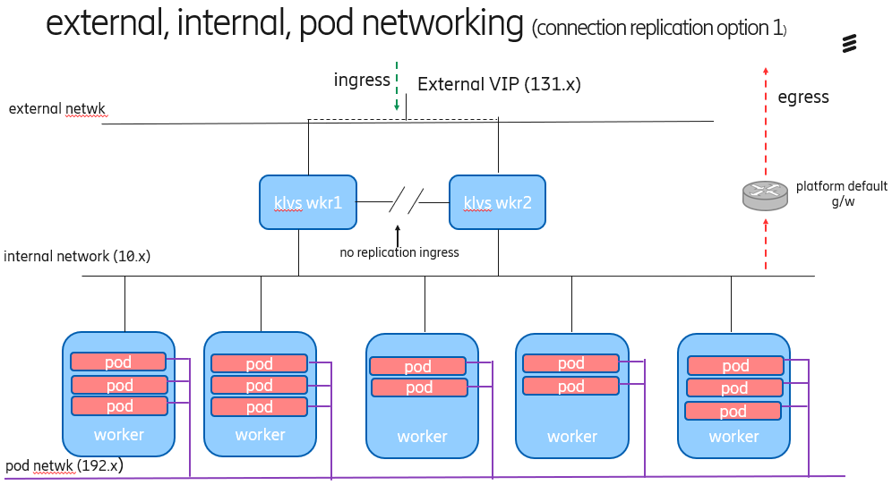
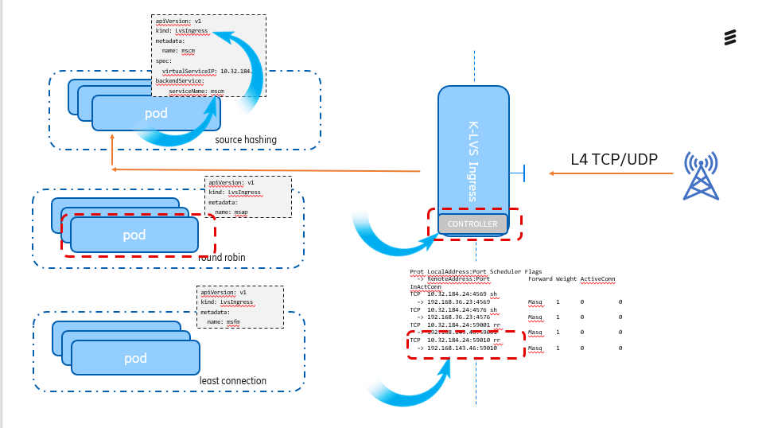
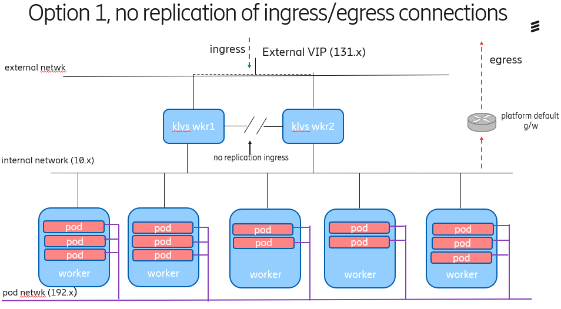
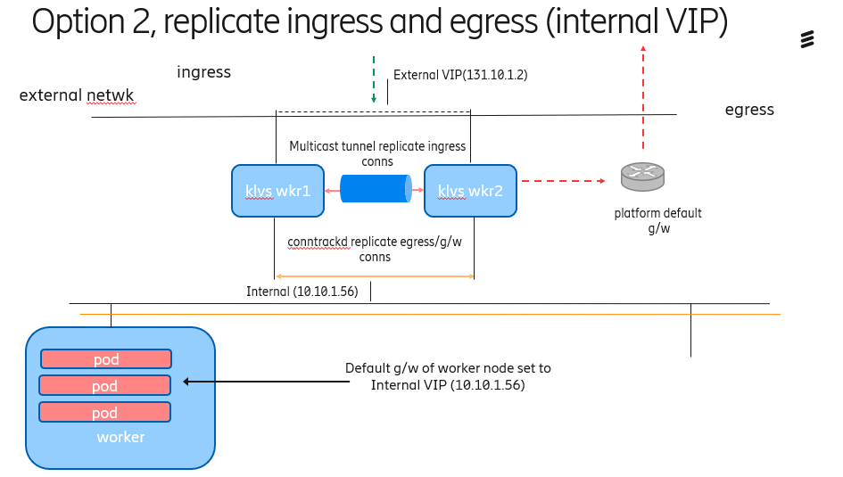
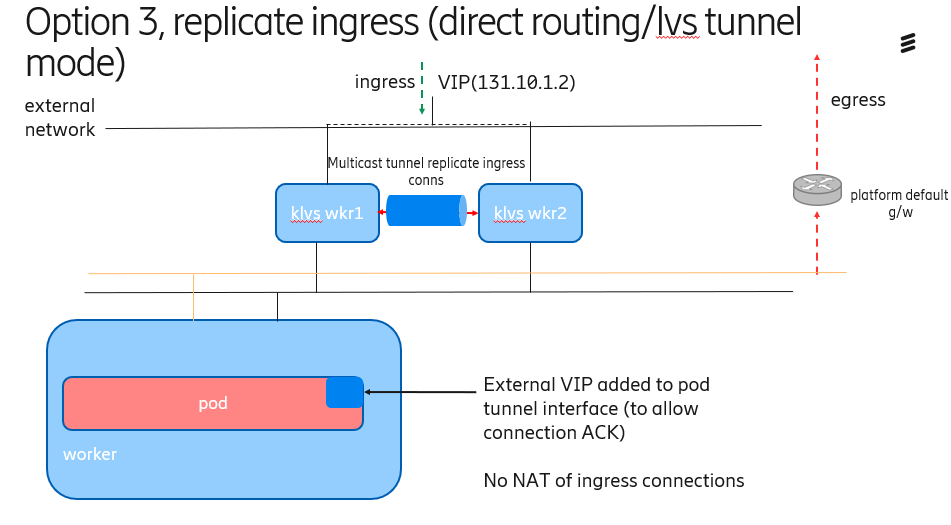
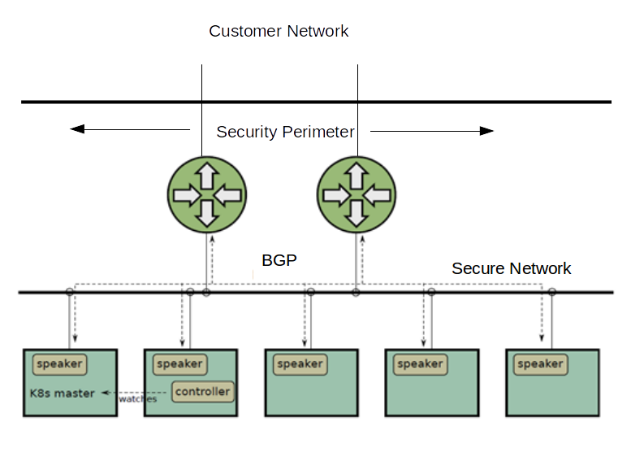

# ENM Kubernetes Routing Technical Report.

<!-- TOC -->

- [ENM Kubernetes Routing Technical Report.](#enm-kubernetes-routing-technical-report)
  - [Revision History](#revision-history)
  - [MRs](#mrs)
  - [Acronyms and Explanations](#acronyms-and-explanations)
  - [Abstract](#abstract)
    - [Supported Ingress Routing Algorithms](#supported-ingress-routing-algorithms)
  - [Out Of Scope](#out-of-scope)
  - [Open Issues](#open-issues)
  - [Decision Log](#decision-log)
  - [Scope](#scope)
    - [ENM Ingress Load Balancing (L4)](#enm-ingress-load-balancing-l4)
    - [Internal Load Balancing](#internal-load-balancing)
  - [Assumptions](#assumptions)
      - [Ingress solution assumes the following](#ingress-solution-assumes-the-following)
  - [Dependencies](#dependencies)
      - [Ingress solution depends on  the following](#ingress-solution-depends-on-the-following)
      - [Internal load balancing depends on the following](#internal-load-balancing-depends-on-the-following)
  - [Overview of Problem](#overview-of-problem)
    - [Ingress](#ingress)
      - [ENM Ingress Load Balancing (L4)](#enm-ingress-load-balancing-l4-1)
        - [Existing Technologies](#existing-technologies)
        - [The Technical Solution](#the-technical-solution)
        - [Solution Networking Diagram](#solution-networking-diagram)
        - [Solution Diagram](#solution-diagram)
        - [Custom Resource Definition (CRD)](#custom-resource-definition-crd)
        - [API](#api)
        - [Controller](#controller)
        - [ericingress_controller](#ericingresscontroller)
        - [node_controller](#nodecontroller)
        - [Controller Image](#controller-image)
        - [Deployment](#deployment)
        - [Upgrade](#upgrade)
        - [High Availability](#high-availability)
        - [BUR](#bur)
        - [Layer 7 (HTTP/S) - ENM Launcher](#layer-7-https---enm-launcher)
        - [Security](#security)
        - [Dimensioning](#dimensioning)
        - [Performance](#performance)
        - [Logging and Metrics](#logging-and-metrics)
        - [Protocols](#protocols)
        - [Application/Delivery of Solution](#applicationdelivery-of-solution)
        - [SLES Implications](#sles-implications)
        - [Egress Routing](#egress-routing)
        - [Public Cloud](#public-cloud)
        - [CNI integration](#cni-integration)
        - [External IPs](#external-ips)
        - [Challenges](#challenges)
          - [Dual Stack](#dual-stack)
      - [Documentation](#documentation)
        - [ECCD Concerns](#eccd-concerns)
        - [Issues](#issues)
        - [Connection Replication](#connection-replication)
        - [Comparison of Connection Replication Solutions](#comparison-of-connection-replication-solutions)
        - [Chosen Option](#chosen-option)
        - [Note:  daemonset overhead](#note-daemonset-overhead)
          - [Required Further Work](#required-further-work)
          - [Future Improvements](#future-improvements)
    - [Internal Load Balancing](#internal-load-balancing-1)
      - [HaProxy](#haproxy)
        - [HaProxy Int](#haproxy-int)
        - [HaProxy SB](#haproxy-sb)
        - [HaProxy Ext](#haproxy-ext)
      - [Challenges](#challenges-1)
        - [Cluster IP](#cluster-ip)
        - [Forgerock Products](#forgerock-products)
  - [Strategic Consideration](#strategic-consideration)
  - [Summary of Requirement](#summary-of-requirement)
  - [Benefit and Value of feature](#benefit-and-value-of-feature)
  - [Technical Debt/Improvements considered](#technical-debtimprovements-considered)
  - [Requirement Clarity Risk Classification(H/M/L)](#requirement-clarity-risk-classificationhml)
  - [Costs](#costs)
  - [Appendix](#appendix)
        - [Off The Shelf Alternatives](#off-the-shelf-alternatives)
        - [ECFE (Metal LB)](#ecfe-metal-lb)
        - [External IPv4 Table](#external-ipv4-table)
        - [Ha-Proxy SB services](#ha-proxy-sb-services)
        - [Sample LVSIngress Custom Resource](#sample-lvsingress-custom-resource)
        - [References](#references)
          - [ECFE Diagram](#ecfe-diagram)

<!-- /TOC -->

## Revision History

| Name                                | Number       | Date       | Version | Author           | Comment                                      |
| ----------------------------------- | ------------ | ---------- | ------- | ---------------- | -------------------------------------------- |
| Kubernetes Routing Technical Report | BDGS-xxx-yyy | 18.10.19   | PA1     | ebrigun, eababub | 1/3 Review                                   |
| Kubernetes Routing Technical Report | BDGS-xxx-yyy | 22.11.19   | PA2     | ebrigun, eababub | Full Review                                  |
| Kubernetes Routing Technical Report | BDGS-xxx-yyy | 22.04.2020 | PA3     | eeidfin          | Updated with design changes for sprint 20.07 |

## MRs
| MR    | Revision | Title                                        | JIRA        | URL                                                                                |
| ----- | -------- | -------------------------------------------- | ----------- | ---------------------------------------------------------------------------------- |
| 63035 | PA2      | Routing & Load Balancing in Cloud Native ENM | TORF-357621 | [IPv4 JIRA](https://jira-oss.seli.wh.rnd.internal.ericsson.com/browse/TORF-357621) |
| 63736 | PA1      | 63736 IP support in cloud native ENM         | TORF-370243 | [IPv6 JIRA](https://jira-oss.seli.wh.rnd.internal.ericsson.com/browse/TORF-370243) |

## Acronyms and Explanations

| Acronym      | Description                                                                                      |
| :----------- | :----------------------------------------------------------------------------------------------- |
| KLVS         | Linux Virtual Server on Kubernetes                                                               |
| Ingress      | Incoming traffic                                                                                 |
| Egress       | Outgoing traffic                                                                                 |
| L4           | Layer 4 of OSI Model                                                                             |
| L7           | Layer 7 of OSI Model                                                                             |
| CRD          | Custom Resource Definition                                                                       |
| Controller   | Software to manage a CRD                                                                         |
| Operator     | Controller and CRD together are called an Operator                                               |
| VIP          | Virtual Internet Protocol Address                                                                |
| BGP          | Border Gateway Protocol                                                                          |
| BFD          | Bidirectional Forwarding Detection                                                               |
| ADP          | Application Development Platform                                                                 |
| HA           | Highly Available/ High Availability                                                              |
| SED          | Site Engineering Document                                                                        |
| BUR          | Backup and Restore                                                                               |
| ECFE         | Ericsson  Front End                                                                              |
| BFD          | Bidirectional Forwarding Detection                                                               |
| VM           | Virtual Machine                                                                                  |
| IPVS         | Internet protocol Virtual Server                                                                 |
| Keepalived   | Routing Software, VIP management tool                                                            |
| Conntrack    | Connection and session management software                                                       |
| CORBA        | Common Object Request Broker Architecture                                                        |
| Operator API | The API thet defines the Controller. This is the Kubernetes extension point. Synonomous with CRD |

## Abstract
ENM has specific Layer 4 ingress traffic requirements where it must be able to dynamically apply specific routing algorithm
(rr, sh etc.) to both TCP and UDP traffic. Supported routing algorithms listed [in supported Ingress Routing Algorithms table](#supported-routing-algorithms). Off the shelf Kubernetes Ingress Controllers mainly focus on L7 traffic and none provided a full highly available solution, options listed ([in alternative approaches considered section below](#alternative-approaches-considered))
Hence, in order to fulfil requirements development of a bespoke solution is necessary. This study looks at the specific solution for L4 Ingress and the consequences and challenges of related routing concerns. This study will further address internal load balancing issues.

### Supported Ingress Routing Algorithms

| Algorithm        | Abbreviation | Comment                             |
| ---------------- | ------------ | ----------------------------------- |
| Round Robin      | rr           |
| Source Hashing   | sh           | Required for node mediation (CORBA) |
| Least Connection | lc           |

## Out Of Scope

| Item 1 | Comment |
| ------ | ------- |
|        |         |

## Open Issues

| Technology                          | Question                                                                                                   | Comment                                                                                                                                 |
| ----------------------------------- | ---------------------------------------------------------------------------------------------------------- | --------------------------------------------------------------------------------------------------------------------------------------- |
| ~~SSO~~                             | ~~Open AM expects a "real" loadbalance in HA mode, can/should this be replaced with a Kubernetes service~~ | To be handled by ha-proxy-int refactor                                                                                                  |
| ~~Egress Route~~                    | ~~Will use default platform egress gateway or set rute on worker nodes~~                                   | We will not set this unless connection replication solution dictates otherwise, see [connection replication](#issues) in Issues section |
| ~~Connectivity~~                    | ~~Why VMs in ENM have external IPs,[listed here](#external-ips)~~                                          | All external NICs in integrated ENM confirmed and to be handled by KLVS Router                                                          |
| ~~SLES Support for keepalived~~     |                                                                                                            | SLES have confirmed support for keepalived in SLE 15                                                                                    |
| ~~Connection replication strategy~~ | ~~As per [connection replication](#issues) section we need to decide which solution to pick~~              | Option 1 chosen                                                                                                                         |


## Decision Log
| Topic              | Decision                                                                     | Owner |
| :----------------- | :--------------------------------------------------------------------------- | ----- |
| Dual Stack Support | Wait for community dual stack support even if Alpha, Ollie to raise with OSG | All   |


## Scope
The scope of this document is to provide a solution that will go straight to design, design base and target listed here:

| Technology | Design Base | target |
| ---------- | ----------- | ------ |
| IPv4       | ENM 19.4    | 20.1   |
| IPv6       | ENM 19.4    | 20.2   |

This document will address the following areas of concern:

### ENM Ingress Load Balancing (L4)
- Existing Technologies
  - Off the shelf ingress controllers
  - ADP ECFE Solution
- The Technical Solution
- Upgrade
  - Upgrade of the Operator API (Detailed below)
- BUR
- Layer 7 Concerns
- Security
  - Root privileges
- Dimensioning
- Deployment
  - Multiple controllers
- Performance
  - Metrics
  - Logging
- Supported traffic protocols
- Application of the solution
- Egress Routing
- Specific Challenges
- Further Work/ Improvements

### Internal Load Balancing

- K8s services
- Internal haproxy
- Legacy Issues
- Specific Challenges

## Assumptions

#### Ingress solution assumes the following

1. Kubernetes platform installed

   - ENM cloud native is a Kubernetes based application therefore it needs a Kubernetes platform, be that ECCD, customer provided or public cloud.
   - CRDs supported since Kubernetes 1.7. This solution has only been tested on Kubernetes 1.15 and 1.16 only

## Dependencies

#### Ingress solution depends on  the following

1. The Kubernetes platform infrastructure must provide a pair of worker nodes per KLVS Router deployment that are reserved (`tainted`) just for KLVS Router
2.  VIPs/external access available

    - The application manages all ingress traffic to ENM. The customer platform must provide a VIP(s) that can be assigned to the KLVS Router
    - The worker nodes that KLVS Router is to be deployed on must have external access
    - External IP of the worker nodes registered in Kubernetes 
3. Kubernetes Delivery of Dual Stack Support for full use case requirements
     - ENM manages ipv4/ipv6 nodes
     - decision is to wait for community support
     - Tracked by this [CCD JIRA ticket for dual stack](https://cc-jira.rnd.ki.sw.ericsson.se/browse/ECE-3968)
4. A number of ENM services are not currently using a proxy in particular IPv6 CORBA
   - All applications need to route traffic through KLVS Router (a proxy)
   - This is a known issue for many of ENM legacy applications
   - All applications with external IP addresses (not using proxy) will be listed and changes may be required. Full list can be seen [in appendix](#external-ips).
5. All applications listed in [external IPs](#external-ips) section must be updated to use this proxy. Each application must investigate their own impacts but this is expected to be mainly a configuration impact. CORBA based connections have a more significant impact with code changes. This has already been identified and implemented prior to this study, reference [MR 55947]{https://jira-oss.seli.wh.rnd.internal.ericsson.com/browse/TORF-238671}
6. IPVS installed on KLVS Router worker node. This is installed by default on ECCD worker nodes.
7. Egress path for outgoing traffic

#### Internal load balancing depends on the following

1. Refactor of HaProxy interaction
   - Applications that currently use HaProxy-internal will need modification to enable migration to using Kubernetes services. A list of these services and proposed solution is listed in [confluence](https://confluence-oss.seli.wh.rnd.internal.ericsson.com/display/EOVP/Investigate+incorrect+use+of+haproxy-int+service+name+in+ENM). This solution is a single track change and must be suitable for all deployment variants.

## Overview of Problem

The bulk of this document and work done to date addresses the significant issue of L4 ingress routing concerns however this document will also discuss internal routing. The [Ingress](#ingress) section below details the overview of the ingress issue and the overview of the internal load balancing issues are detailed in the [Internal Load Balancing](#internal-load-balancing) section.

### Ingress

In integrated/cloud ENM ingress is achieved via a number of methods, namely:

- LVS Router (Southbound mediation)
- HaProxy External (Launcher/Corba NBIs)
- HaProxy Southbound (Listed in Appendix)
- Externally Routable VMs (Listed in appendix)

As per abstract, ENM has specific Layer 4 ingress traffic requirements where it must be able to dynamically apply a specific routing algorithm to both TCP and UDP traffic. Off the shelf Kubernetes Ingress Controllers do not fulfill this requirement so a bespoke in house development is required. The solution must:

- Handle all L4 traffic
- Be able to apply specific routing algorithms to each L4 connection
- Be upgrade-able
- Be highly available
- Be dynamic
  - Be able to modify connection configuration in a highly available manner i.e. restart of ingress service not required to add/remove connections or modify scheduling algorithms
  - Be able to add/remove back end services in highly available manner
- Kubernetes platform agnostic
- Pass through any URL/path based L7 traffic to a L7 ingress controller i.e. ENM Launcher Traffic
- The solution must be capable of replacing all existing Integrated ENM ingress solutions already mentioned mentioned above (LVS Router etc.)

It is a design goal to achieve all requirements and have parity with legacy functionality with minimal to no impact on existing applications

#### ENM Ingress Load Balancing (L4)

##### Existing Technologies

No existing off the shelf option fulfilled requirements, either from the community or from ADP. The alternatives investigated can be seen in the [appendix](#appendix) section.


##### The Technical Solution
The chosen technical solution is a Kubernetes Operator to be developed in house, consisting of a Custom Resource Definition and a Controller deployed on tainted worker nodes. The solution makes use of existing technologies such as ipvs, keepalived, conntrackd. The roles of each of the technologies are listed here:

| Technology                 | Function                                                            | Comment                    |
| -------------------------- | ------------------------------------------------------------------- | -------------------------- |
| Custom Resource Definition | Defines the API to manage Ingress connections                       |
| Operator                   | The software to manage the API and inbound connection routing       |
| Keepalived                 | VIP management                                                      | Requires privileged access |
| Conntrackd                 | Egress connection tracking between peer nodes                       | Requires privileged access |
| ipvs                       | Underlying routing software used to define inbound connection rules | requires privileged access |

##### Solution Networking Diagram

The below diagram presents an overall view of the solution from a networking perspective. This document present three options for connection replication and this diagram represents option 1, no replication. Whatever replication option is chosen does not materially effect this view whose goal is to illustrate the different networks, the external network, the internal network and the pod network.



##### Solution Diagram

Below is a diagram of the deployed solution.



##### Custom Resource Definition (CRD)

Custom resources are extensions of the Kubernetes API. A resource is an endpoint in the Kubernetes API that stores a collection of API objects of a certain kind. For example, the built-in pods resource contains a collection of Pod objects.

A custom resource is an extension of the Kubernetes API that is not necessarily available in a default Kubernetes installation. It represents a customisation of a particular Kubernetes installation.

The CustomResourceDefinition API resource allows you to define custom resources. Defining a CRD object creates a new custom resource with a name and schema that you specify. The Kubernetes API serves and handles the storage of your custom resource [[1]](#references)
##### API

Shown here is a snippet of The Custom Resource Definition or API as defined by this solution.
```
package v1alpha1
type LvsIngressSpec struct {
    VirtualServiceIP string `json:"virtualServiceIP"`
    BackendService Backend `json:"backendService"`
}

type Backend struct {

    ServiceName string `json:"serviceName"`
    PortMappings []PortMappings `json:"portMappings"`
}

type PortMappings struct {

    LbPort int `json:"lbPort"`
    SvcPort int `json:"svcPort"`
    Protocol string `json:"protocol"`
    Sch string `json:"sch"`
}

type LvsIngressStatus struct {
   
    ChangeID int `json:"changeId,omitempty"`
}


```

The code above defines the API and is a published extension of the Kubernetes API. This allows ENM applications to create objects of our custom type (`kind: LvsIngress`) (via a simple `yaml` file, example in appendix) and store them in Kubernetes. The Controller software is then written to manage all resources of this type.

##### Controller

The Controller software was written using the Kubebuilder Framework [[2]](#references). It handles all CRUD operations related to the Custom Resources and any other resources it is interested in e.g. Kubernetes Endpoints (full list in table below).

The application code contains three separate controllers listed below and they react to any CRUD events in order to write and maintain all ingress forwarding rules. Based on these CRUD events the controllers execute `ipvsadm` commands. All listed controllers register with a single `controller manager`.

| Controller                | Function                                    | Comment |
| ------------------------- | ------------------------------------------- | ------- |
| ericingress_controller.go | Handles CRUD of the custom resource         |         |
| svc_controller.go         | Handles CRUD of Kubernetes service objects  |         |
| endpoint-controller.go    | Handles CRUD of Kubernetes endpoint objects |         |
| node_controller.go        | Handles CRUD of Kubernetes node objects     |         |

##### ericingress_controller

The ericingress_controller is responsible for populating the lvsrouter ip routing table with the routing rules from each ENM service. The routing rules specify the 

- protocol
- source vip and port
- Destination backend ip and port
- Routing algorithm
- Here is a section of the lvsrouter ip table 

```
bash-4.4# ipvsadm -Ln
IP Virtual Server version 1.2.1 (size=4096)
Prot LocalAddress:Port Scheduler Flags
  -> RemoteAddress:Port           Forward Weight ActiveConn InActConn
TCP  10.232.35.199:1389 lc
  -> 192.168.67.114:1389          Masq    1      0          0
  -> 192.168.182.140:1389         Masq    1      0          0
TCP  10.232.35.199:1636 lc
  -> 192.168.67.114:1636          Masq    1      0          0
  -> 192.168.182.140:1636         Masq    1      0          0
TCP  10.232.35.199:4569 sh
  -> 192.168.26.214:4569          Masq    1      0          0
TCP  10.232.35.199:4570 sh
  -> 192.168.26.214:4570          Masq    1      0          0
```

Any ENM service requiring routing via lvsrouter must create an EricIngress object similar to the one shown below. When the EricIngress object is created or deleted in the cluster the controller receives an event and adds or removes the mappings to the lvsrouter ip table.

```
{{- if .Values.global.ericIngress.enabled }}
apiVersion: routing.ericingress.ericsson.com/v1alpha1
kind: EricIngress
metadata:
  name: mscm
spec:
  virtualServiceIP: {{ .Values.global.vips.cm_vip_address }}
  backends:
    name: mscm
    config:
      - portRange:
          vipPortRange:
            start: 58978
            end: 58979
          svcPortRange:
            start: 58978
            end: 58979
        protocol: tcp
        algo: sh
        mode: nat
{{- end }}
```


##### node_controller

The node_controller is responsible for 

1. Adding an ExternalIP address label to the node object e.g. 

   ```
   externalIP=10.232.35.31
   ```

   The controller works out the externalIP as follows.

   ```
   ief, err := net.InterfaceByName(os.Getenv("EXTERNAL_INTERFACE"))
   ```

2. Creating the keepalived configuration file 

   The controller adds the src and peer ipaddress to the keepalived.conf file.
   The controller also adds the vips to the keepalived.conf file.

   ```
   global_defs {
     vrrp_version 3
   }
   vrrp_instance VI_1 {
       state BACKUP
   
       interface eth1
       virtual_router_id 106
       priority 100
       nopreempt
       advert_int 1
       unicast_src_ip 10.232.35.41
   
       unicast_peer {
           10.232.35.31
       }
   
       virtual_ipaddress {
       10.232.35.203
       10.232.35.200
       10.232.35.205
       10.232.35.199
       10.232.35.204
       10.232.35.201
       10.232.35.202
     }
   }
   ```

   

3. Starting the keepalived service.

   Once the keepalived.conf file is written the node controller starts the keepalived service as follows.

   ```
   	k.cmd = exec.Command("keepalived", "--dont-fork", "--release-vips",
   		"--pid", "/keepalived.pid")
   ```

   

##### Controller Image

The Controller Docker image is built from SLES base as per PDU direction. It contains the application management software (the controller) with keepalived, conntrack-tools and ipvsadm. IPVS kernel module is assumed to be loaded on the worker node

##### Deployment

- Worker Nodes
  The Operator will be installed on `tainted`[[3]](#references) worker nodes only to ensure no other pods get deployed here and using `NodeAffinity` or `NodeSelector` [[7]](#references) to ensure it does not get deployed elsewhere. No other pods should be deployed on these nodes. The operator will be deployed as a statefulset with two replicas and therefore will expect two worker nodes per statefulset to ensure high availability. The KLVSRouter PodSpec will have to include a matching `toleration` to ensure it will get deployed on that worker node
  
  - The tainting of the worker nodes will be a pre-installation administration task, this should be documented in the installation guide, infrastructure planning. Taint format is `<key>=<value>:<effect>` so an example of `klvs-taint:klvs:NoSchedule` means that any pods without this `toleration` will not get scheduled here. The KLVSRouter statefulset would then be configured similar to below to ensure it has correct toleration. This will ensure that no other pod without this toleration can be deployed on this node, 
        
              
        key: "node"
        operator: Equal
        value: "routing"
    
  - To ensure that KLVSRouter does get deployed on the correct worker nodes (and not scheduled on some other worker node) `NodeAffinity` preferably (or `NodeSelector`, this is on deprecation path) and `Labels` are required Examples can be seen [here, [8]](#references).
- Helm Charts
  - Helm chart will be part of Platform Integration Chart
  - Installation of the Helm charts will:
    - Install the API
    - Install the Controller stateful set
    - Create required services account
    - This should be part of platform Integration chart
  - The values.yaml will contain the address of the VIP(s) to be exposed and any other necessary configuration.
  - The API must be installed prior to any application using it e.g. delivering their custom resource.
- Multiple domains/instances
  - If there are multiple domains/instances of the Router required they will all be using the same API definition. The API can only be installed once. For example if ENM router is installed and then the scripting router is subsequently installed it will fail as it will try to create an already existing API in Kubernetes. A mechanism is needed to handle this scenario and allow one time only creation of API but multiple router domains. Some possibilities are a toggle flag in helm chart / values.yaml or an init container and so on.
  Handling is also required so that the KLVS Router only reconciles requests on a per domain basis, that is the ENM KLVS Router does not react to scripting domain events and vice versa.

##### Upgrade

- Upgrade of the Controller

   Upgrade will be orchestrated via Helm. The Operator is deployed as an statefulset so Kubernetes will ensure that this is a rolling upgrade and ensures service availability at all times. All changes to the controller software should be backward compatible to allow for multiple versions of the software running in parallel during upgrade

   The Controller upgrades should take care that backward compatibility also applies to version changes of the underlying API. See next section
  
- Upgrade of API
  
  The CustomResourceDefinition API versions field can be used to support multiple versions of custom resources. Versions can have different schemas, and conversion webhooks can convert custom resources between versions. Webhook conversions should follow the Kubernetes API conventions wherever applicable [[4]](#references)

- Maintenance and deprecation of API version
  
   The Operator can choose to live with multiple versions if it wishes and as long as the code is written to handle it there should be no issue. However it is likely at some stage that an old version of the custom resources will need to be migrated to a newer version, Kubernetes provides a number of options when upgrading API versions, namely webhook conversions [[5]](#references) as mentioned above and a migrator tool [[6]](#references). Either option is acceptable.

- Upgrade of worker node
  
  Upgrade of the worker nodes must be done in a rolling over node manner to ensure high availability. This is the responsibility of the platform administrators. It is possible extra health checks will be required here to enable this in conjunction with a `PodDistruptionBudget` [[8]](#references) which will ensure availability during a infrastructure upgrade
      
  
##### High Availability

High availability of the solution can be divided into the following sections
- HA of the Controller software
  
  HA of the controller is achieved by deploying it as a stateful set with a `replica` size of `2`. It operates in an `active:active` manner and all forwarding rules, virtual services etc are written to both worker nodes at the same time.
  As described above the statefulset should be deployed using anti-affinity rules ensuring each pod is running on a separate tainted worker node. The controller should implement it's own `liveness` and `readiness` probes. 

- HA of the VIP (external)
  
  HA of the VIP is managed by keepalived. Keepalived is configured to operate in an `active:passive` manner and it will manage swapping the VIP between the worker nodes.

- HA (replication) of active connections
  
  Replication of ingress and egress solutions are discussed in [Connection replication](#issues) below. Replication and maintenance of egress connections is a platform concern as the application does not impose any egress specifications nor doesis get involved with setting outgoing VIPs or gateways. Ingress connections are not replicated or maintained. Recovery scenarios from a VIP failover or HA event are are detailed in the [Connection Replication, chosen option](#chosen-option) section of Challenges.

##### BUR

There are no BUR concerns for this solution. The controller will recreate all incoming connection rules based on application delivered KLVS Router custom resources.

##### Layer 7 (HTTP/S) - ENM Launcher

Layer 7 traffic to ENM Launcher will use an "off the shelf" ingress controller delivered by ADP. This should be deployed behind KLVS Router, which will provide a simple pass through. The L7 ingress controller will not need an externally routable VIP. This should be provided (proxied) by KLVS Router,

`user --> klvs router --> L7 ingress controller --> ENM Launcher`

The backend L7 services are manged by the L7 ingress controller.

In the case of a public cloud where the infrastructure _can_ manage availability of an VIP/elastic IP the L7 ingress controller _can_ be deployed separately *if desired* or behind KLVS Router as described above

##### Security

- General
  
  The same interfaces/protocols/VIPs will be exposed in a Kubernetes environment as in integrated ENM. No extra security procedures are required for this. The customer cloud will be locked down as per usual firewall rules with just the minimum ports and protocols exposed.

- Integration with Kubernetes API
  
  The Operator requires a `ClusterRole` in order to fetch resources across name spaces. The cluster role created has access to the following resources

  ```
  lvsingress
  Endpoints
  Services
  Nodes
  ```

  Role permission follows RESTful verb authorisation pattern. For example, for the `lvsingress` resource  the permission looks like:

  ```(yaml)
  rules
  apiGroups:
  - routing.lvsingress.ericsson.com
  resources:
  - lvsingresses
  verbs:
  - get
  - list
  - watch
  - create
  - update
  - patch
  - delete
  ```

but for `Service` resources we only need to observe so the permission looks like:

 ```(yaml)
  resources:
  - Services
  verbs:
  - get
  - watch
  - list
 ```
This role and privileges are all defined within the KLVS Router code base (charts).

- Privileged Containers

  - As the solution incorporates Linux kernel modules (`ip_vs`,`keepalived`,`conntrackd`) the deployed container must run in privileged mode. For this reason (and for performance, traffic isolation) the Controller should be deployed on `tainted` worker nodes only where no other pods can be deployed. This is a notable security feature that must be documented. This has the added benefit of reducing attack surface plane and helps mitigate security concerns.
  - Depending on the solution chosen additional privileged init containers (or other mechanism, daemonset etc) may be required to set routing gateways. These are listed in the [connection replication](#issues) section below.
  - All solution listed in the [connection replication](#issues) require that `/proc/sys/net/ipv4/vs/conntrack=1` is set.

  There are two separate specific MRs dealing with security and are in progress, details:

| Title                                    | JIRA        | URL                                                                                |
| ---------------------------------------- | ----------- | ---------------------------------------------------------------------------------- |
| 63037 Cloud Native ENM Security          | TORF-357623 | [IPv4 JIRA](https://jira-oss.seli.wh.rnd.internal.ericsson.com/browse/TORF-357623) |
| 63495 Secure Cloud Native ENM Deployment | TORF-364461 | [IPv6 JIRA](https://jira-oss.seli.wh.rnd.internal.ericsson.com/browse/TORF-364461) |

##### Dimensioning

Dimensioning (of worker node and pod) is not a significant concern for this KLVS Router solution. It performs a simple routing job and the bulk of any CPU/RAM intensive work will be done by service/data layer applications.

That said it is important that a bench-marking procedure is carried out in order to initially size the router worker nodes and Controller containers and know how to scale these for large and small deployments. It is recommended that ENM and scripting operate their own KLVS Router worker node pairs due to the significant traffic pattern differences. If these are combined for smaller deployments then a specific dimensioning exercise is again important to determine sizing.

The initial sizing of the router worker node is expected to be similar to the ENM OpenStack deployed LVS Router which is of the order of 2vcpu and 2GB RAM (maximum available VM flavour).

There is a general Cloud native dimensioning study details:

| Title                                              | JIRA        | URL                                                                                |
| -------------------------------------------------- | ----------- | ---------------------------------------------------------------------------------- |
| 60354 Dimensioning of cloud-native ENM deployments | TORF-321348 | [IPv4 JIRA](https://jira-oss.seli.wh.rnd.internal.ericsson.com/browse/TORF-321348) |


##### Performance

Initially for smaller deployments it is recommended that there will be two HA pairs of worker nodes to deploy this solution. One pair of worker nodes for ENM "services cluster" applications and one pair for "scripting cluster" applications. Scripting cluster applications are likely to be more heavyweight than ENM services cluster applications.

As stated above, an initial benchmarking task is required to gain insight into best practice sizing of these router worker nodes. Today in Integrated ENM, ENM has a dedicated 10GB fibre channel, a similar SLA is required to expect similar performance

##### Logging and Metrics

- Logging

  As this is the first "real cloud native" application in ENM logs should not use rsyslog as per legacy ENM applications. Logging should be sent to `stdout` and ADP services such as Logshipper should be incorporated to send the logs to `ElasticSearch`.

  Note: `ENM Log Viewer` was developed using rsyslog  metadata as a reference point. In a cloud native logging solution these rsyslog metadata fields are not available and thus LogViewer cannot display or search these logs as efficiently as rsyslog compliant log entries.

  It may be necessary to use a log transformation service from ADP if the Logshipper configuration is not flexible enough to integrate. A `POC` was completed on ADP logging by Pathfinders and initial findings indicate that there is enough functionality to use this without transformation but improvements are desired. In addition a story should be written on Log Viewer to support cloud native logging

- Metrics

  KLVS Router should expose a metrics endpoint(s) to Prometheus that returns all relevant status statistics. e.g. established ipvs routes, number of connections and so on. Query of `ipvs` should be sufficient for all required information. Suggested (but not limited to) statistics:

  - Ingress virtual services
  - Back end services
  - Number of Connections
  - Location of VIP
  - Forwarding rules
  - Number of packets/bytes per virtual service

##### Protocols

This solution supports all Layer 4 UDP and TCP traffic. This solution also supports L7 traffic but all URL based HTTP/S ingress management should be handled by a specific ADP delivered L7 ingress controller.

##### Application/Delivery of Solution

This solution is being developed to address ENM specific issues but it will be delivered as an ADP common service and investigations are ongoing as to the possibility of delivering this to the community.

##### SLES Implications

This solution is an evolution of the LVS Router solution in Integrated ENM and thus attempted to reuse the same technologies where possible. In the mean time corporate strategy dictates that we must move to a SLES based operating system whereas existing deployments are based on RHEL. Initially SLES did not support `keepalived` but they have since confirmed they will support it. Planned POCs for alternative technologies such as pacemaker are now not required.

##### Egress Routing

Egress routing will be via whatever the default gateway of the worker nodes is set to. The exact specification or location of this has no bearing on the solution. The solution only requires an egress path out. The only supported CCD deployment network architecture as per latest documentation [[9]](#references) is with an external IP address on each worker node.

##### Public Cloud

The solution is agnostic of any underlying Kubernetes implementation and will work equally well on public or private cloud. However there is extra work required to integrate with a public cloud's `elastic IP` as this is not the same as a cloud `VIP`.

The requirement also exists that the public cloud will allow a container to have privileged access to a worker node, which has been proven on AWS already.


##### CNI integration

POC and development was carried out on multiple Kubernetes platforms and has been proven with Calico and Kubenet CNIs. The solution does not make any use if any specific CNI functionality and was developed to be agnostic of any CNI (one slight complication, see [connection replication](#issues)). It has only been tested on two CNIs (mainly Calico) and it is a possibility that minor configuration updates might be required for a different CNI.

ECCD default configuration means Calico is deployed in IP-IP mode which sets up tunnels between worker nodes. The solution has been mainly tested in this mode but also sanity checked when Calico was configured as a flat network.

##### External IPs

All ingress traffic previously routed through external ip addresses listed in [appendix](#appendix) will now be directed through KLVS Router. Some applications require refactoring to set a `proxy` but most will be agnostic of this change.

There will however be CPI and troubleshooting document updates.

For IPv6 traffic many of mediation servers, while they don't "publish" their external IPv6 address they are externally routable and they do not use `proxy`. Communication with NetworkElements is maintained using this interface once connection is established. This is a legacy issue from integrated ENM. This is not recommended going forward, all applications with externally routable IPv6 interfaces need to change to use KLVS Router external VIP as their proxy for ingress notifications (and as pod interface if direct routing chosen, see [connection replication](#issues)). This is a know issue in ENM.

##### Challenges

This section highlights any particular challenges that need to be discussed and may require special attention

###### Dual Stack

Kubernetes dual stack deployments (IPv4 & IPv6) is not generally available but has recently been released with an Alpha version.  ENM requires this in order to be able to manage IPv4/v6 network elements using one ENM. With that in mind a bespoke solution to allow ENM manage IPv4 and IPv6 nodes was POC'd and proven. As mentioned earlier in the document, the strategy now is to wait for the community to deliver dual stack support and not to implement a bespoke solution.

Concerns around this are mainly focused on the maturity of the Alpha version and when this might be GA. Communications are ongoing with EST to establish a firm time-line for release. Depending on the maturity of the alpha/beta version of this and how this aligns to ENM release plans this may have an impact on this Operator code and how ENM will define its dual stack services.

As mentioned earlier separate code changes will be required in ENM code anyway regardless of solutions to use a proxy, both of approximate equal costing but both significantly different modifications.

- ECCD Dual Stack Support

  This was deemed unsuitable because it would require changes to significant ENM code to manage IPv6 nodes as IPV4 and require change of behaviour in customer procedures. Similar to the concerns with the ENM POC'd workaround this is an bespoke solution and is not a Kubernetes native feature.

#### Documentation

Installation guide, planning infrastructure should be updated to reflect the following

- Installation guide, planning infrastructure should be updated to reflect the following
  - Taint and NodeSelector Updates
  - IPVS requirement on KLVS Worker node.
- Troubleshooting guide
  - This impact should be included with ongoing troubleshooting guide updates.
  
##### ECCD Concerns

None at present. KLVS Router will be installed as part of ENM installation once ECCD platform (or Kubernetes) is available.

##### Issues

##### Connection Replication

Integrated ENM replicates all ingress and egress connections. Egress connections are synced via conntrackd running on LVS Router and Ingress connections are synced via ipvs sync d which uses `Multicast`. Use of multicast in cloud native environments is generally disabled. Integrated ENM also sets a default gateway for all egress traffic meaning it must now take responsibility for the maintenance of egress connections. Three options available to address this issue are:

1. ##### Do not sync ingress or egress connections (Selected Option)



This is the simplest and most robust option.

___Ingress___

Ingress connections are usually active for a short time period. A connection is established, the notifications(s) is sent and then the TCP connection remains established but not doing anything until default TCP timeout of 20 mins has expired. Comparing this with "long lived" connection use cases such as SSH where connection is maintained for a long period. Based on investigations it do not appear these ingress connections require maintenance or replication (Meeting scheduled with domain expert to confirm). A 60K test environment was used for investigation and only 77 established connections were observed of which 46 were `source hashing` CORBA connections. None of these are long lived connections are most likely not sending any information at the time of the investigation. If one connection was interrupted when sending a notification then a `CONNECTION_RESET` would be sent and the node would retry on next heartbeat. Conceivably there is little to no impact in not maintaining ingress connections.

*Live Ingress Failure Handling (VIP failover or KLVSRouter HA event)*

In the case of CORBA communications there are a few failure scenarios
 - if  the next communication is southbound (ENM to Node) then no loss of conenctivity or management will be observed.
 - If the node has no established ingress connection (has not sent a notification in with TCP timout window, usually 15-20 mins) then no loss of connectivity or management will be observed.
 - If the node has an established ingress connection (has sent notification within the TCP timeout window, usually 15-20 mins) and the next communication is northbound (node to ENM) then this  notification will fail. The node will receive a TCP reset and all changes will be buffered on the node. ENM will re-manage this node on the next heartbeat (maximum possible delay of 7 minutes) and will receive all buffered changes.

In the case ingress FM NBI connections clients will automatically retry on failure.
In the case ingress PM Push, nodes will automatically retry on failure.
In the case of On Demand PM Push failure will be detected by ENM and ENM will automatically retry on failure.
In the case of ingress SSH connections, these will have to be reestablished.

*SNAT* 

In order for backend pods be able to `ACK` to any incoming connection, an SNAT iptables rule must be applied on the KLVS Router worker node. If this rule is not applied then the connection cannot be established as the backend POD does not know the route to ACK the connection it just received.

`iptables -t nat -A POSTROUTING -o tunl0 -j MASQUERADE `

___Egress___

In Integrated ENM it specifically sets the default route/gateway to the LVS Router instance(s) so all egress connections go through it. In order to achieve this, LVS Router has a highly available internal VIP that the default route is set to. As ENM has decided to set the default gateway it must now manage it and the connections using it. In order to maintain high availability of the connections using this VIP conntrackd is used to replicate connections (`UNICAST`) between the worker nodes for scenarios when the VIP is switched from one LVS Router instance to another. In the 60k test environment used above the synced `egress` connections were of the order of 22 k established with a further 6k in `TIME_WAIT` or `CLOSE_WAIT`. This is a significant use case to maintain if we choose to do so

If the underlying infrastructure router or gateway goes down then it is up to the infrastructure to handle this or connections must be reestablished. This is outside the scope of ENM, Integrated to Cloud Native.

There is no requirement in Cloud Native ENM to set the default route so therefore if we do not manage the default route there is no requirement to manage it and replicate connections. This can be left to the platform to manage. There is no loss of non functional requirements.

2. ##### Sync ingress and egress connections (Internal VIP)



The external VIP is managed by `keepalived` and this successfully manages the VP between the worker nodes. Under the hood `ipvssync` is used to managed the live connections and ensure no loss of connectivity of ingress connections. There are two issues with this

- Use of multicast to sync the connections
- KLVS Worker Nodes on separate subnets means that a connection failover, even though it appears synced, fails.

  One option to overcome the issues is to use an overlay network between the worker nodes to allow multicast traffic and to use an internal VIP between the worker nodes as the default route thus allowing successful connection failover.

  - Multicast Protocol
    - This could be mitigated by deploying a overlay network between the two worker nodes and multicast traffic could be directed down this tunnel.
  - Worker Nodes on separate subnets
    - As the networking on a Kubernetes environment is completely different than in Integrated ENM and each LVS Router worker node is on a separate subnet, so even though `ipvssync` successfully manages to replicate the connections (albeit currently via multicast) the failover of live connection from client (network element) to backend service cannot be maintained as the stored connection information refers to a different subnet (worker node 1 vs worker node 2) and failover fails.
    - This can be mitigated by using an **internal VIP** on the worker nodes. 
    - This has the knock on effect of requiring ENM to set default route to this VIP on **all** worker nodes. This could be achieved a number of ways such as via a pre deploy administration Kubernetes job or an init container on all applications.
    - This has further knock on effect of now requiring ENM to now manage egress connections. This can be done using `conntrackd` as per Integrated ENM

3. ##### Sync ingress connections only (Direct Routing)



Another option is to use `direct routing` for ingress connections. This allows the pod to reply directly to the client without going back through the KLVS Router. This is achieved by adding the existing external VIP to a non ARP interface on the pod e.g. loopback or tunnel interface. In addition the `rp_filter` parameter for this device must be turned off, this is a kernel parameter. Also, an iptables rule is require on the worker node to accept traffic from the external VIP.

This solution means the ipvs sync daemon will be able to manage connections in a case where external VIP is switched from one worker node to another. Egress connections would be managed by the underlying platform.


##### Comparison of Connection Replication Solutions

| Solution                           | Conntrack on Lvsrouter (kernel setting) | MASQ/SNAT rule on LVS Router | IP Overlay Network (Multicast) | Conntrackd running on LVSRouter | Privileged access to worker node Pod        | Privileged access to backend worker node     | Modify CNI Config | Comment                                                                          |
| ---------------------------------- | --------------------------------------- | ---------------------------- | ------------------------------ | ------------------------------- | ------------------------------------------- | -------------------------------------------- | ----------------- | -------------------------------------------------------------------------------- |
| No Sync                            | Y                                       | Y                            | N                              | N                               | N                                           | N                                            | N                 | Implications of non maintenance of ingress connection unclear but appear minimal |
| Internal VIP (sync both)           | Y                                       | N                            | Y                              | Y                               | N                                           | Y (set default gateway)                      | N                 | Complex set up, daemonset overhead                                               |
| Direct Routing (sync ingress only) | Y                                       | N                            | Y                              | N                               | Y (set VIP on pod i/f, NET_ADMIN privilege) | Y (turn rp_filter off, generic and specific) | N                 | Most complex set up,daemonset overhead                                           |


##### Chosen Option

The chosen option is Option 1, no replication of ingress or egress connecetions by by ENM. It is a platform requirement to provide a fully HA traffic gateway for egress traffic. 
Ingress fai

##### Note:  daemonset overhead 
It's likely the only way to achieve some of required kernel settings will be via a daemonset to get access to worker node kernel settings (init container only has access to it's pods own namespace). Daemonset do not have the concept of a job so they be running all the time while effectively redundant (largely redundant) after doing it's job at the very start.


###### Required Further Work

- Dual Stack support
  ENM is required to manage both IPv4 and IPv6 nodes with one ENM instance, thus dual stack support from K8s is required. ENM has the option to implement it's bespoke solution (already POC'd) or wait for official K8s dual stack support. The decision thus far is to wait for official K8s support.
  - Either option has a different impact on KLVS Router code and updates are required.
  - Implementation depends on overall dual stack solution chosen (K8s native dual stack versus bespoke )
  - Work to do is clear in both cases
  - Work to do in both cases is approximately of same cost

###### Future Improvements

- VIP definition in Custom resource only. Currently it is handled in the Controller configuration. 
  - If handled in the custom resource VIPs could be dynamically added to a running KLVS Router and supported by simple reload of keepalived configuration.

- Run in single instance mode
  - Useful for test and small deployments

- ECCD has ipvs module installed by default. Insert handling to deal with scenarios where it gets deployed on worker nodes that does not have IPVS installed.

- Namespace Support
  - Current implementation listens to all events in all namespaces. Future improvements should allow KLVS Router to only listen for events on particular namespaces.This will support multiple ENMs to be deployed in the same Kubernetes cluster.

### Internal Load Balancing

Internal load balancing in Integrated ENM makes use of static files and IP addresses such as `/etc/hosts` files on virtual machines and hard coded IP addresses in the SED. On Openstack ENM there have been improvements made and applications use Consul for service discovery in many cases, however this is not true for all cases.  There is technical debt in many of the solutions such as happroxy acting as haproxy-int for SSO and services such as FM incorrectly using ha-proxy-int in such a way that it does not actually "proxy" but just acts as a repeater/pass-through.

It is necessary to address these and other technical debt configurations (hard coded ip addresses, use of /etc/hosts file, ip addresses in NFS ) in order to deprecate this existing functionality in favour of cloud native configurations and technologies e.g. a kubernetes service instead of haproxy where appropriate. As per previous the goal is to limit any impacts on existing applications but it is unavoidable here.

#### HaProxy

##### HaProxy Int

The details of the haproxy-int issue and solution are detailed here on [confluence](https://confluence-oss.seli.wh.rnd.internal.ericsson.com/display/EOVP/Investigate+incorrect+use+of+haproxy-int+service+name+in+ENM). To summarise, refactor of haproxy-int, the client service groups are required in addition to updates to cloud templates and deployment description

Once this is complete this will remove all internal hard-coded dependency on haproxy-int. This will then enable the missing use-cases in CN ENM as Kubernetes services will now do the job of haproxy-int. The same configuration code will now work in all environments and the applications will be agnostic of whether ha-proxy-int, or kubernetes or something else is load balancing their endpoints.

##### HaProxy SB

All current HAProxy SB ingress points should be handled by KLVS Router. Services using HaProxy-Sb listed in Appendix.

##### HaProxy Ext

1. HAProxy External Ingress points should be replaced by KLVS Router as stated in the rest of this document. Haproxy External also handles ingress path based `HTTP(S)` routing for ENM Launcher (GUI). This traffic will be initially resolved by KLVS Router which will then pass it through to the L7 INgress controller for processing. The current ADP approved L7 ingress controller is Contour. This custom resource should be delivered by the L7 Ingress Controller application.

2. HaProxy External also acts as an internal load balancer for SSO (this should be removed). This is been handled by this MR 63546 which details the introduction of containerised ForgeRock components

| Title                                               | JIRA        | URL                                                                                |
| --------------------------------------------------- | ----------- | ---------------------------------------------------------------------------------- |
| 63546 Uplift of AAA components for cloud native ENM | TORF-365836 | [JIRA Link](https://jira-oss.seli.wh.rnd.internal.ericsson.com/browse/TORF-365836) |

#### Challenges

##### Cluster IP

The current license manager, Sentinel / LCMServ solution, does not work as currently configured when placed behind a Kubernetes Service (ClusterIP), they are unable to accept connections from a Cluster IP (VIP). In order to overcome this the service is created in `clusterIP:none`.

Sentinel is planned to be replaced by ADP Licence Manager and the above workaround will not be required once this is complete.

##### Forgerock Products

Forgerock products have a number of limitations in service resolution and clustering. The products, their roles and limitations are listed here.

| Products     | Comment                                     |
| ------------ | ------------------------------------------- |
| OpenAm (SSO) | Includes web policy agent deployed on httpd |
| OpenDJ       |
| OpenIDM      |

1. SSO binds to it's hosts FQDN and it expects this to be of the format `sso.FQDN`. Kubernetes does not support registration of services with dots so the current implementation is broken.

2. SSO configuration happens in a non cloud native manner. It expects to be deployed and then it executes a series of scripts to configure itself and then restarts. This process can take a number of minutes.

3. SSO and Open DJ also have  the concept of master slave and the current scripted implementation to handle this does not transfer to Cloud Native deployments

All of the above and the implemented CN workarounds to overcome are significant impediments to deployment and operation, however they are not blockers. They can lead to significant service outages and the workarounds are only meant as a short term fix. Ultimately these issue will be solved by MR 63546 which handles the introduction of CN ForgeRock products.

| Title                                               | JIRA        | URL                                                                                |
| --------------------------------------------------- | ----------- | ---------------------------------------------------------------------------------- |
| 63546 Uplift of AAA components for cloud native ENM | TORF-365836 | [JIRA Link](https://jira-oss.seli.wh.rnd.internal.ericsson.com/browse/TORF-365836) |

## Strategic Consideration

## Summary of Requirement

## Benefit and Value of feature

## Technical Debt/Improvements considered

## Requirement Clarity Risk Classification(H/M/L)

## Costs

Cost in man sprints

| Description                              | Cost | Comment                                                                        |
| ---------------------------------------- | ---- | ------------------------------------------------------------------------------ |
| Operator (IPv4 only)                     | 4    | Potentially more expensive depending on connection replication strategy chosen |
| Dual stack support                       | 1    |
| HaProxy-Int Refactor                     | 1    |
| HaProxy-Ext Refactor                     | 1    |
| Proxy setting per app                    | X    | To be costed by each team                                                      |
| Haproxy clients refactor                 | 1    |                                                                                |
| Applications to add LvsIngress to charts | 3    |                                                                                |
| Documentation updates                    | 2    |                                                                                |
| Configuration Daemonsets                 | 2    | Daemonset or other mechanism to achieve same                                   |


## Appendix

##### Off The Shelf Alternatives
The following off the shelf alternatives were studied and none were suitable. A summary of pros and cons are listed in the table below

| Ingress Controller    | Pros                               | Cons                     |
| --------------------- | ---------------------------------- | ------------------------ |
| Istio (Envoy based)   | Dynamic Configuration              | No UDP                   |
|                       |                                    | No LB Algorithms for TCP |
|                       |                                    | Enforces TLS on TCP      |
| Traefik               |                                    | No TCP                   |
|                       |                                    | No UDP                   |
| Contour (Envoy Based) | Dynamic Configuration              | No UDP                   |
|                       |                                    | Enforces TLS on TCP      |
| Voyager (haproxy)     | Dynamic Configuration              | No UDP                   |
|                       | Supports algorithms for L4         |
| Nginx                 | Supports algorithms for TCP/UDP/L7 | Static Configuration     |
|                       | Not HA                             |

##### ECFE (Metal LB)

Metal LB was deemed unsuitable for numerous reason listed below. Ultimately the requirement on a customer to allow us to configure their infrastructure and the dependency this would create on ENM was deemed unsatisfactory by SPM.

Summary of factors that informed this decision are:

If using the BGP option:

- The Gateway Routers must support the BGP-4 routing protocol with the multiple - paths configuration feature.
- The Gateway Routers must support Multiprotocol Extension for BGP.
- The Gateway Routers are configured for single-hop eBGP peering.
- The "Multiprotocol Extension for BGP" is needed only if the traffic handled by ECFE is IPv6

If using the BFD option:

- The Gateway Routers must support static routes monitored by the BFD protocol, in asynchronous mode.
- ECMP Loadbalancing must be enabled on the Gateway Routers for multiple paths operation to take effect.

Common to both (BGP/BFD):
- Less control on where traffic goes (next hop after router)
- Using metal LB places a requirement on customer infrastructure to support it.

##### External IPv4 Table

| IP                              | Handled By This Solution | Comment                           |
| ------------------------------- | ------------------------ | --------------------------------- |
| lvsrouter_external_ip_list      | Y                        | Services Router                   |
| scripting_external_ip_list      | Y                        | Scripting ROuter                  |
| visinamingsb_external_ip_list   | Y                        | Services Router                   |
| cnom_external_ip_list           | Y                        | Services Router                   |
| nbalarmirp_external_ip_list     | Y                        | Services Router                   |
| winfiol_external_ip_list        | Y                        | Scripting Router                  |
| haproxy_external_ip_list        | Y                        | Services Router                   |
| visinamingnb_external_ip_list   | Y                        | Services Router                   |
| nfspm_external_ip_list          | Y                        | Services Router                   |
| haproxysb_external_ip_list      | Y                        | Services Router                   |
| elementmanager_external_ip_list | Y                        | Scripting Router                  |
| svc_FM_vip_external_ip          | Y                        | Services Router                   |
| svc_CM_vip_external_ip          | Y                        | Services Router                   |
| amos_external_ip_list           | Y                        | Scripting Router                  |
| emp_external_ip_list            | Y                        | Services Router (if in CN)        |
| svc_PM_vip_external_ip_address  | Y                        | Services Router                   |
| esmon_external_ip_list          | Y                        | Services Router (included in CN?) |
| itservices_external_ip_list     | Y                        | Services Router                   |
| nfspmlinks_external_ip_list     | N                        | FileStore provided by platform    |

##### Ha-Proxy SB services


| Service   | Protocol | Ports                  |
| --------- | -------- | ---------------------- |
| pkiraserv | TCP      | 8090, 8091, 8092, 8093 |
| mssnmpfm  | TCP      | 8080, 8443             |


##### Sample LVSIngress Custom Resource

    apiVersion: routing.lvsingress.ericsson.com/v1alpha1​
    kind: LvsIngress​
    metadata:​
     name: lvsingress-samba7​
    spec:​
     virtualServiceIP: 10.32.184.59​
     backendService:​
      serviceName: tcpserver7​ 
      portMappings:​
      - lbPort: 8080​
        svcPort: 8080​
        protocol: tcp​
        sch: sh​
      - lbPort: 7070​
        protocol: tcp​
        svcPort: 7070​
        sch: rr

##### References
[1] https://kubernetes.io/docs/tasks/access-kubernetes-api/custom-resources/custom-resource-definitions/
[2] https://github.com/kubernetes-sigs/kubebuilder
[3] https://kubernetes.io/docs/concepts/configuration/taint-and-toleration/
[4] https://kubernetes.io/docs/tasks/access-kubernetes-api/custom-resources/custom-resource-definition-versioning/
[5] https://kubernetes.io/docs/tasks/access-kubernetes-api/custom-resources/custom-resource-definition-versioning/#webhook-conversion
[6] https://github.com/kubernetes-sigs/kube-storage-version-migrator
[7] https://kubernetes.io/docs/concepts/configuration/assign-pod-node/
[8] https://kubernetes.io/docs/concepts/workloads/pods/disruptions/
[9] http://cpistore.internal.ericsson.com/elex?LI=EN/LZN7920009%2a

###### ECFE Diagram



