# Upgrade/Lifecycle Management of cloud native ENM

**Author(s)**:  
Michael Cantwell

**Keyword(s**)  
ENM, upgrade,LCM

**Abstract**  
Technical Report for Upgrade of ENM Cloud Native.

[TOC]

# Introduction

## Revision History
| Revison | Prepared         | Date       | Comment                                                      |
| ------- | ---------------- | ---------- | ------------------------------------------------------------ |
| PA1     | Michael Cantwell | 25/11/2019 | First Draft                                                  |
| PA2     | Michael Cantwell | 7/1/2020   | Updates from comment after 1/3  Gerrit Review https://gerrit.ericsson.se/#/c/6552508/ |
| PA3     | Michael Cantwell | 29/1/2020  | Updates for full review.                                     |
| PA4     | Michael Cantwell | 17/02/2020 | Updates after full review comments.                          |
| A       | Michael Cantwell | 21/02/2020 | Setting to full revision after meeting with SL. Filesystem Expansion chapter added. |

## Focal Point Requirement

105 65-0334/63496 Lifecycle Management of cloud native ENM\
<https://jira-oss.seli.wh.rnd.internal.ericsson.com/browse/TORF-364462>

**Current Main Requirement Text:**
Upgrade of cloud native ENM: It shall be possible to execute upgrade of cloud native ENM Application software using Helm charts. The availability and upgrade times of ENM applications during this upgrade, should be the same or better than the existing ***ENM deployments*** i.e. Critical services must be available. Critical services are regarded as those where data loss from the network is not acceptable (e.g. Alarms from NEs). Upgrade of the first cloud native ENM should be comparable with upgrade 'Small ENM on openstack cloud' deployment.

**Proposed Main Requirement Text:**
Upgrade of cloud native ENM: It shall be possible to execute upgrade of cloud native ENM Application software using Helm charts. The availability and upgrade times of ENM applications during this upgrade, should be the same or better than the existing ***"Small ENM On Openstack Cloud"*** i.e. Critical services must be available. Critical services are regarded as those where data loss from the network is not acceptable (e.g. Alarms from NEs). Upgrade of the first cloud native ENM should be comparable with upgrade 'Small ENM on openstack cloud' deployment.

### MR compliance

Availability - Compliant.  Same level of availability will be maintained during upgrade as in "Small ENM On Openstack Cloud"

Upgrade Times - Compliant.  Upgrade times will be the comparable with "Small ENM on Openstack Cloud"

Number of Steps in Upgrade - Compliant.  Number of steps in the cENM upgrade will be comparable with "Small ENM on Openstack Cloud"

Flexibility - Partially Compliant.  Due to the use of Helm for cENM, ENM can no longer rely on the orchestrator(ENMinst scripts(physical)/Camunda Workflows(openstack)) to interject during install to run a bespoke procedures(ie [Follower,Follower,Leader Neo4j](https://jira-oss.seli.wh.rnd.internal.ericsson.com/browse/TORF-331422)). Previously design teams would have pushed the responsibility to the orchestrator, in cENM a change in focus is required by the design teams, they have full responsibility of there application from end to end and need to implement any bespoke procedures as part of the Application deliverable or by extending kubernetes via on [Operator](https://kubernetes.io/docs/concepts/extend-kubernetes/operator/).

## Purpose

The purpose of this report is to analyze the options to deliver an ENM cloud Native upgrade procedure through Helm Charts adhering to the "lift & Shift" approach for ENM. This document will also include best practices for Upgrade & service availability of a Cloud Native OSS product.

## Scope

### In Scope

-   Upgrade impacts to support ENM Cloud Native, this includes:
    -   Update to Deployment artifacts(Helm Chart/DockerFile)
        -   Including updates to maintain availability during rolling over worker node upgrade
    -   Application Software Update
-   Filesystem Expansion
-   Pod AntiAffinity
-   Best practices to maintain Service Availability during Life Cycle Management of an OSS portfolio Cloud Native Application.

### Out of Scope

-   Platform Upgrade.
    -   Procedure to be provided by CaaS providers.
        -   The default kubernetes cluster upgrade is [one node at a time](https://kubernetes.io/docs/tasks/administer-cluster/kubeadm/kubeadm-upgrade/#upgrade-worker-nodes) and will drain the nodes which will prepare the node for maintenance by marking it unschedulable and evicting the workloads.  ENM workloads will drain for the node that is to be upgraded and the kubernetes scheduler will then schedule the workload on a worker node that has free resources(should be included in [Cloud Native Dimensioning](https://jira-oss.seli.wh.rnd.internal.ericsson.com/browse/TORF-321348)). If the application is single instance there will be downtime as its switches nodes. This is the same behaviour as in "Small ENM openstack cloud"
-   Infrastructure Upgrade - server(s) hosting the Worker Nodes.
    -   Responsibility of Cloud Provider.
        -   The author can not quantify the ENM impacts. Expectation would be that the Cloud Provider  would drain the kubernetes worker node prior to upgrading/patching the host. In that case the impacts are the same as the CaaS upgrade
-   Application Resilience
    -   The following design rules are taking into account by ENM design teams when introducing new applications, [Upgrade process and relevant Design Rules](https://confluence-oss.seli.wh.rnd.internal.ericsson.com/pages/viewpage.action?spaceKey=E1I&title=Upgrade+process+and+relevant+Design+Rules)
    -    [EO HA pre-study](https://jira-oss.seli.wh.rnd.internal.ericsson.com/browse/SM-32791) ongoing. Outcome of this study should be a number of design rules for Cloud Native microservices.
-   Backup/Restore
    -   Covered in separate study.  [TORF-335537](https://jira-oss.seli.wh.rnd.internal.ericsson.com/browse/TORF-335537)  
-   System Expansion
    -   Out of scope as stated in "[ENM - Small Cloud Native Prepre Study](https://erilink.ericsson.se/eridoc/erl/objectId/09004cffc2c99438?docno=501/0363-10/FCP1302584Uen&format=msw8)"
-   Geo Redundancy
    -   Out of scope as stated in "[ENM - Small Cloud Native Prepre Study](https://erilink.ericsson.se/eridoc/erl/objectId/09004cffc2c99438?docno=501/0363-10/FCP1302584Uen&format=msw8)"
-   Upgrade of customized Service Groups/Applications
    -   Out of scope as stated in "[ENM - Small Cloud Native Prepre Study](https://erilink.ericsson.se/eridoc/erl/objectId/09004cffc2c99438?docno=501/0363-10/FCP1302584Uen&format=msw8)"

## Open Issues

N/A

## Decision Log
N/A

## Assumptions
N/A

## Dependencies/Pre-requisite

-   [Initial Install, Product and Application CSAR structure, Software Delivery](https://erilink.ericsson.se/eridoc/erl/objectId/09004cffc2d3ecad?docno=BDGS-19:006499Uen&action=current&format=msw12)
    
    -   Full end to end flow completed including:
        -   Client containing the Helm Client binary.
        -   Scripts to load and tag docker images.
        -   Helm Integration Charts layout realised.
        -   Site Engineering values file.
    -   Associated Documentation.
    
-   [Cloud Native Dimensioning](https://jira-oss.seli.wh.rnd.internal.ericsson.com/browse/TORF-321348)
    
    -   Full Highly Available ENM dimensioned comparable with"Small ENM Openstack cloud".
    -   [Multiple instance defined for ENM applications](https://jira-oss.seli.wh.rnd.internal.ericsson.com/browse/TORF-404527 )
    
-   [All Phase 0 service groups migrated to phase 1](https://jira-oss.seli.wh.rnd.internal.ericsson.com/browse/TORF-405197) - no installation of software at startup of application.
    
-   [Backup, Restore and Rollback for Cloud Native ENM](https://erilink.ericsson.se/eridoc/erl/objectId/09004cffc35b9ad2?docno=295/10268-10/FCP1302584Uen&format=msw12)
    
    -   Upgrade Documentation will refer to the Backup & Restore Solution pre & post upgrade.
    
- [Cloud Native ENM Security]([TORF-364461](https://jira-oss.seli.wh.rnd.internal.ericsson.com/browse/TORF-364461))

  -   Work required to containerise ENM security components and forgerock uplift.

- [ENM Library Charts to standardise ENM helm chart](https://jira-oss.seli.wh.rnd.internal.ericsson.com/browse/OSSEPTAP-8777).

  -   Ensure uniform changes across all applications, removes duplication of work when updating charts.

  

## Input/Related Studies

- [ENM - Small Cloud Native Prepre Study](https://erilink.ericsson.se/eridoc/erl/objectId/09004cffc2c99438?docno=501/0363-10/FCP1302584Uen&format=msw8)

- "Upgrade/Lifecycle Management of cloud native ENM" is a requested output of this Prepre study.

-   [ENM system Capacity](https://erilink.ericsson.se/eridoc/erl/objectId/09004cffc3320b96?docno=3/1555-AOM901151Uen&format=pdf)  3/1555-AOM 901 151
    Documents the Current Upgrade times/Out of Service times per service for "\'Small ENM on openstack cloud" that Cloud Native should adhere too.
    
-   [Model Deployment evolution](https://jira-oss.seli.wh.rnd.internal.ericsson.com/browse/OSSEPTAP-8772)
    
    -   TA to cover the Evolution of Model Deployment which will cater for Cloud Native.
    
    

# Overview of Problem

## General

1.  The main concern for a customer is to maintain application availability while deploying new releases of software in a predictable way.

2.  In certain products there may be startup dependencies that need to be satisfied for on application to come up properly, for new cloud native applicaton this should not be a case as all dependencies should be included with the application but taking ENM as on example there may be a number of dependencies between stateful and stateless service, this requires the software to be upgraded in a ordered manner to satisfy these dependencies. Order being:

    -   Stateful Services.

    -   Stateless Services.

### ENM Specifics

In Physical ENM the upgrade is orchestrated via LITP plan while in vENM the upgrade is orchestrated via Camunda Workflows.
The following diagram while simplified for clarity shows the dependency complexity @ service startup during install & upgrade.

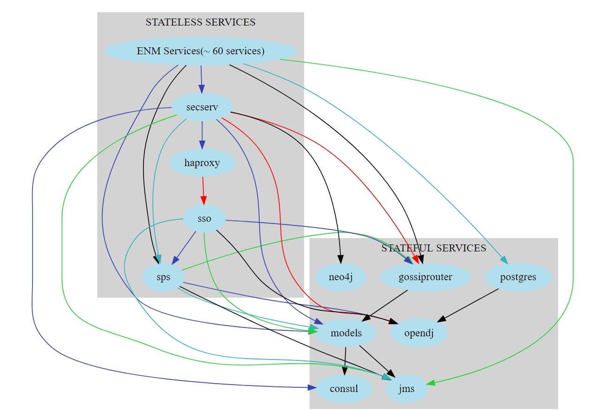

# Solution

## General Overview

Through the delivery of ENM software via "helm integration charts"(see "Initial Install, Product and Application CSAR structure" [Ref [1]](#References)) each integration chart can be installed or upgraded using a "helm upgrade" command similar to below:

\# helm upgrade –install  <release name>  --values  <values file>  <chart location> --namespace <namespace> --wait –timeout <timeout value>

An helm upgrade takes an existing release and upgrades it according to the information you provide. Because Kubernetes charts can be large and complex, Helm tries to perform the least invasive upgrade. It will only update things that have changed since the last release.

At install/upgrade time, Helm collects all of the resources in a given Integration Chart including its dependencies, groups them by resource type, and then install/upgrade them in the [following order](https://github.com/helm/helm/blob/release-2.16/pkg/tiller/kind_sorter.go#L29):

1.  Namespace
2.  ResourceQuota
3.  LimitRange
4.  PodSecurityPolicy
5.  Secret
6.  ConfigMap
7.  StorageClass
8.  PersistentVolume
9.  PersistentVolumeClaim
10. ServiceAccount
11. CustomResourceDefinition
12. ClusterRole
13. ClusterRoleBinding
14. Role
15. RoleBinding
16. Service
17. DaemonSet
18. Pod
19. ReplicationController
20. ReplicaSet
21. Deployment
22. StatefulSet
23. Job
24. CronJob
25. Ingress
26. APIService

This order ensures for example that PersistentVolume(8&9) is created and ready in time for when Kubernetes brings up a StatefulSet(18-22) that needs attached storage.
To ensure that a successful Helm Release the "--wait" flag is used in conjunction with the "--timeout" command.
A successful upgrade of the integration chart will return a Success Return code(ret 0) to the end user. If a failed upgrade of the integration chart has happened an Error Return code(ret 1) is returned to the end user.
By default, Kubernetes will update all StatefulSets & Deployment in a "RollingUpdate" manner and will wait for the Readiness Probe if defined to pass before moving onto the next pod in the ReplicaSet. Kubernetes by default ensures that at least 75% of the desired number of Pods are up (25% max unavailable) and ensures that at most 125% of the desired number of Pods are up (25% max surge).

### Availability

In general you should replicate your application if you require high availability. Kubernetes provides several disruption handling features which ENM will utilize to maintain availability during upgrade & disruptions and will be discussed later in the report:

-   [updateStrategy](#UpdateStrategy)
-   [Graceful termination and Lifecycle hooks](#Graceful-Termination-and-Lifecycle-Hooks)
-   [Pod AntiAffinity](#Pod-AntiAffinity)
-   [Resource Requests](#Resource-Requests)

### Upgrade Flow

The upgrade flow will follow a generic format:

1.  ENM Software available via CSAR
    -   Helm Charts copied to Helm Client
    -   Docker Images tagged & pushed to Docker Registry
    -   Site Engineering File(integration values.yaml) copied to Helm Client
2.  Validate current installed Helm Release

3.  Call backup procedure.

4.  Run helm upgrade of the integration chart(s).

5.  Run Acceptance test to validate upgraded Helm Release

6.  Remove backup if satisfied or call Rollback procedure.

**Note:** The above flow does not prevent implementation/automation of upgrade via SWDP.

### ENM Specifics

As described in [Initial Install, Product and Application CSAR structure ](https://erilink.ericsson.se/eridoc/erl/objectId/09004cffc2d3ecad?docno=BDGS-19:006499Uen&action=current&format=msw12) software will be delivered via a number of helm integration charts and should be installed/upgraded in the following sequence:

-   ENM Platform

-   ENM Stateful

-   ENM Stateless

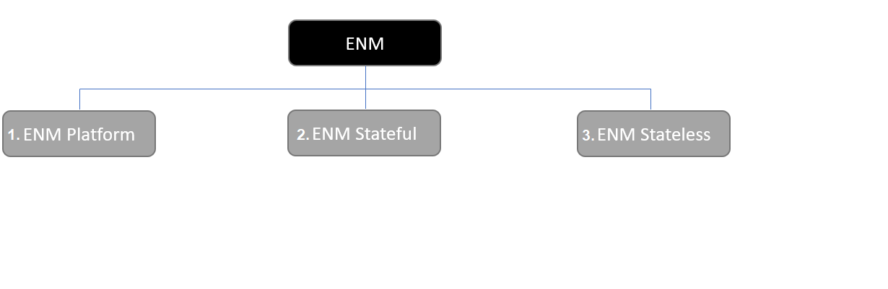

This will ensure that the application startup dependencies are met much like there are today in ENM Physical & vENM.

## Feature Concepts

N/A

## Link to GUI Mockup

N/A

## System Impact

N/A

# Technical Analysis

## UpdateStrategy

For [Deployments](https://kubernetes.io/docs/concepts/workloads/controllers/deployment/), [StatefulSets](https://kubernetes.io/docs/concepts/workloads/controllers/statefulset/) & [DaemonSets](https://kubernetes.io/docs/concepts/workloads/controllers/daemonset/) the default update strategies is  [rolling update](https://kubernetes.io/docs/tasks/run-application/rolling-update-replication-controller/) which will maintain availability during upgrade.
Statefulsets & DaemonSets also have "OnDelete" where the controller will not automatically update the Pods. Users must manually delete Pods to cause the controller to create new Pods that reflect the changes. "OnDelete" will not be discussed further in this document.

### Deployment

Kubernetes Deployment updates Pods in a [rolling update](https://kubernetes.io/docs/tasks/run-application/rolling-update-replication-controller/) fashion when type=RollingUpdate.
You can specify maxUnavailable and maxSurge to control the rolling update process.

rollingUpdate.maxUnavailable is an optional field that specifies the maximum number of Pods that can be unavailable during the update process. The value can be an absolute number (for example, 5) or a percentage of desired Pods (for example, 10%). The absolute number is calculated from percentage by rounding down. The value cannot be 0 if rollingUpdate.maxSurge is 0. The default value is 25%.

rollingUpdate.maxSurge is an optional field that specifies the maximum number of Pods that can be created over the desired number of Pods. The value can be an absolute number (for example, 5) or a percentage of desired Pods (for example, 10%). The value cannot be 0 if MaxUnavailable is 0. The absolute number is calculated from the percentage by rounding up. The default value is 25%.

Looking at the following examples configurations "maxSurge=1 & maxUnavailable=0" will give greater application availability compared to "maxSurge=0 & maxUnavailable=1" as your number of available pods will never drop below you deployed number of instances.

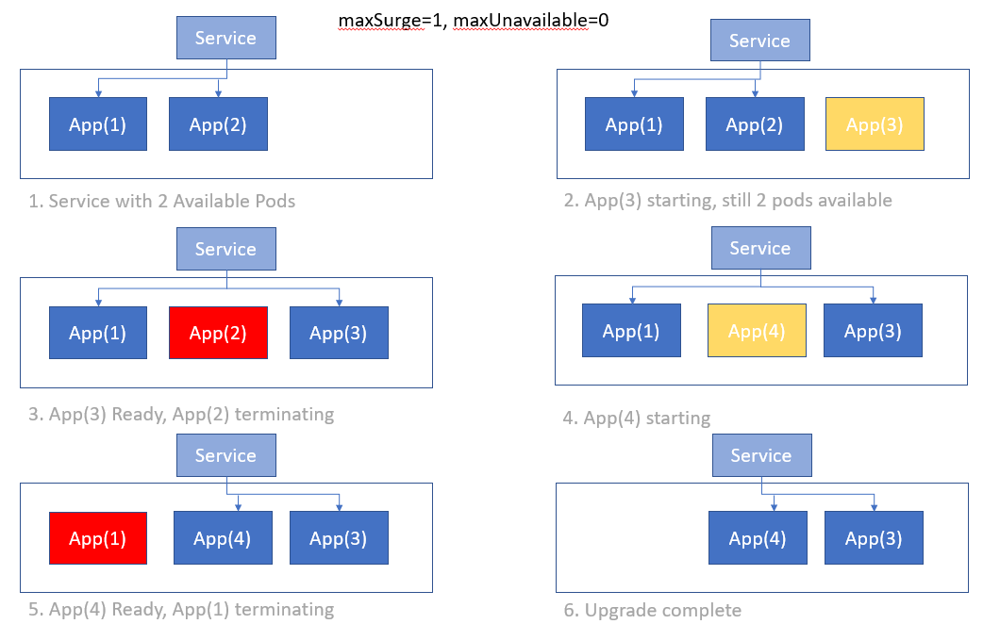

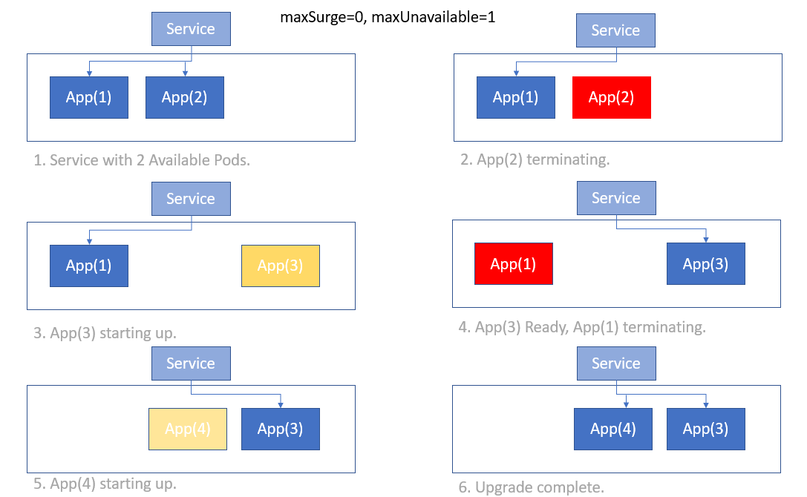

#### ENM impacts UpdateStrategy Deployment

For applications running as Deployments, maxSurge and maxUnavailable should be configurable via the application values.yaml in the Helm Chart.
Traditionally in ENM physical and vENM the application being upgrade would be deleted first(scaled down) before upgrading/adding back in the instance, following with the "lift & shift" approach configuration  of "maxSurge=0 & maxUnavailable=1" should be the default configuration requiring no extra resource overhead.  
In "Small ENM Openstack Cloud" openstack the upgrade requires a 25% additional resource overhead as openstack reserve the resources for the new VM before deleting the old VM. This additional overhead is not required at runtime and vENM customer were not happy with this extra resource requirement at upgrade.

At time of writing there is no expectancy for ENM to scale out first, if required this can be taking on a case by case basic and would also drive a percentage overhead requirement of resources that should be included in the "Infrastructure Planning Guide", resource footprint is required by customer 6 months prior to GA.

With default settings of "maxSurge=0 & maxUnavailable=1" no extra resource requirements are needed.

If a deployment has a single instance there will be downtime as per "Small ENM Openstack cloud" today.

### StatefulSet

The RollingUpdate update strategy will update all Pods in a StatefulSet, in reverse ordinal order, while respecting the StatefulSet guarantees. The StatefulSet controller terminates each Pod and waits for it to transition to Running and Ready prior to updating the next Pod. Note that, even though the StatefulSet controller will not proceed to update the next Pod until its ordinal successor is Running and Ready, it will restore any Pod that fails during the update to its current version. Pods that have already received the update will be restored to the updated version, and Pods that have not yet received the update will be restored to the previous version. In this way, the controller attempts to continue to keep the application healthy and the update consistent in the presence of intermittent failures.

Note: For ENM in the case of failure it will result in a failed upgrade. A decision then is taking to Rollback or [Fix Forward](#Failed-Upgrade-Fix-Forward)

Statefulset that include PVC claim template should not include labels and annotations. Kubernetes does not allow any parameter in a PVC template to be changed. See [DR-HC-06](https://confluence.lmera.ericsson.se/display/AA/Helm+Chart+Design+Rules+and+Guidelines#HelmChartDesignRulesandGuidelines-DR-HC-064).

#### ENM impacts UpdateStrategy StatefulSet

For applications running as StatefulSets the default settings for RollingUpdate are to be used.  "maxSurge & maxUnavailable" configuration should be removed from any helm chart for StatefulSets.

For single instances statefulset the Pod is delete first releasing the volume so the new Pod can attach. 

If a statefulset has a single instance there will be downtime as per "Small ENM Openstack cloud" today. 

### DaemonSet

With RollingUpdate update strategy, old DaemonSet pods will be killed, and new DaemonSet pods will be created automatically, in a controlled fashion

Optionally maxUnavailable determines the maximum number of DaemonSet Pods that can be unavailable during updates. The default value, if omitted, is 1. The value cannot be 0. The value can be an absolute number or a percentage.

#### ENM impacts UpdateStrategy DaemonSet

For applications running as DaemonSets no updates required as defaults should suffice.

## Graceful Termination and Lifecycle Hooks

Detailed termination of a pod is documented at [Termination of Pod in Kubernetes](https://kubernetes.io/docs/concepts/workloads/pods/pod/#termination-of-pods)

In summary:

-   Pod is set to "Terminating" State

-   preStop Hook is executed if defined

-   SIGTERM signal is sent to pod

-   K8s waits for termination grace period(default 30sec)

-   SIGKILL signal sent to pod and the pod is removed

terminationGracePeriodSeconds can be configured thru the helm chart as shown below.

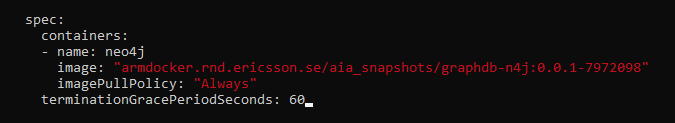

Kubernetes provide container lifecycle hooks, for application requiring the Container preStop hook they can be configured in the application Helm charts

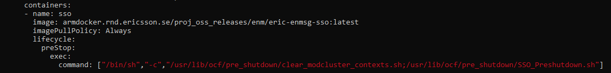

### ENM Impacts Graceful Termination and Lifecycle Hooks

Only FMX in vENM has a shutdown timeout of 60 seconds but this is due to the number of services it is stopping within a VM, for cloud native these services need to be broken out to separate containers depending out the outcome of the following spike [OSSEPTAP-7673](https://jira-oss.seli.wh.rnd.internal.ericsson.com/browse/OSSEPTAP-7673). Therefore, the default of 30 seconds should suffice.

ENM applications need to handle the SIGTERM signal and begin shutting down the process. The SIGTERM signal is the normal shutdown signal sent to the PID that would be used today in the init scripts in physical ENM and vENM.

Looking at vENM there are certain application that run a pre-shutdown script prior to the application terminating.

Below table goes thru these applications and impacts and where necessary they should run the pre\_shutdown scripts using the preStop hook

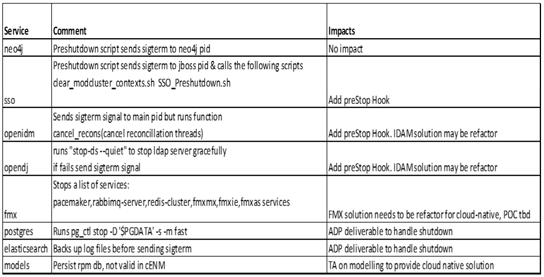

## Pod AntiAffinity

Each deployment or StatefulSet with more than 1 replica will be required to configure PodAntiAffinity to ensure the scheduler does not co-locate replicas on a single worker node.

There are currently two types of pod affinity and anti-affinity, called requiredDuringSchedulingIgnoredDuringExecution and preferredDuringSchedulingIgnoredDuringExecution which denote "hard" vs. "soft" requirements.

The following example show how mscm which for "Small ENM on openstack cloud" should have 2 replicas can include PodAntiAffinity to its helm chart so the replica's will reside on different worker nodes.

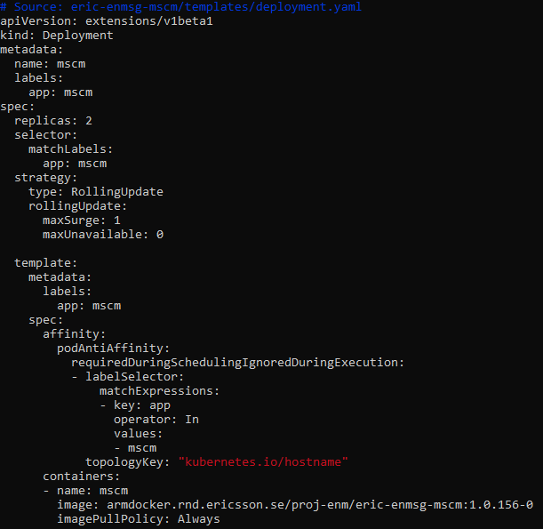

**Note**: Pod anti-affinity requires nodes to be consistently labelled, i.e. every node in the cluster must have an appropriate label matching topologyKey. If some or all nodes are missing the specified topologyKey label, it can lead to unintended behavior.

### ENM impacts PodAntiAffinity

Authors recommendation is to add hard antiaffinity rules(requiredDuringSchedulingIgnoredDuringExecution) by default in ENM but make it configurable through the values.yaml of the application.

The Dimensioning study for Cloud Native is incomplete at time of writing this technical report but the current proposal is to follow [small ENM openstack cloud](https://gerrit.ericsson.se/plugins/gitiles/OSS/com.ericsson.oss.itpf.deployment/enm-cloudtemplates/+/refs/heads/master/design-utilities/managed_configs/Size/deployment_sizes.csv), the following services listed in the table have at least 2 or more replica's. For each of these services the PodAntiAffinity configuration is required to be added to their application helm Chart.

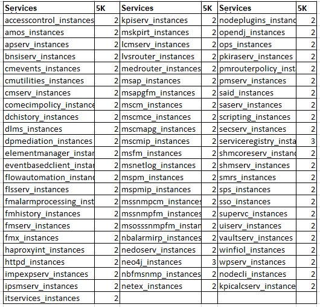

## Application to Application PodAntiAffinity

Is some cases there may be a need that 2 applications with high workload are not scheduled to the same worker node. The below example ensures that the 3 neo4j replicas are deployed on separate workloads and also are not deployed where a schedule replica of postgres resides.

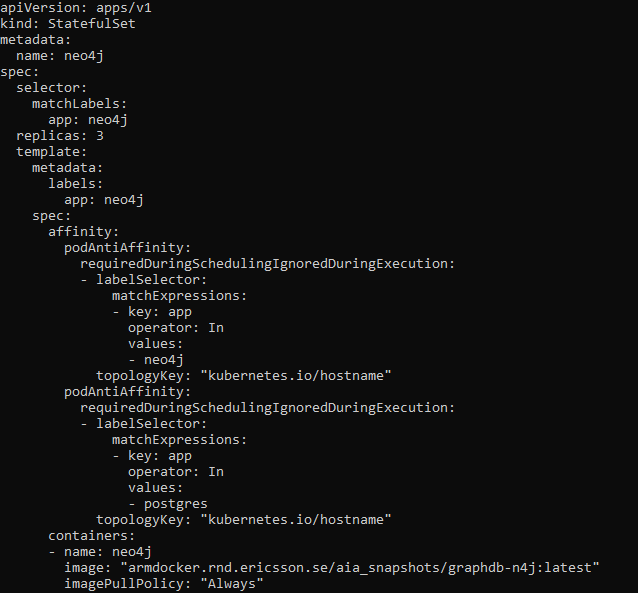

### ENM impacts Inter Application PodAntiAffinity

Currently there is no application anti-affinity provided for "small ENM openstack cloud"so at time of writing it is not envisaged in cENM, if it is required for cENM it can be upgraded in later.

## Resource Requests

When you specify a [Pod](https://kubernetes.io/docs/concepts/workloads/pods/pod/), you can optionally specify how much CPU and memory (RAM) each Container needs. When Containers have resource requests specified, the scheduler can make better decisions about which nodes to place Pods on. And when Containers have their limits specified, contention for resources on a node can be handled in a specified manner.

Each Container of a Pod can specify one or more of the following:

-   spec.containers\[\].resources.limits.cpu

-   spec.containers\[\].resources.limits.memory

-   spec.containers\[\].resources.limits.hugepages-\<size\>

-   spec.containers\[\].resources.requests.cpu

-   spec.containers\[\].resources.requests.memory

-   spec.containers\[\].resources.requests.hugepages-\<size\>

A Pod resource request/limit for a particular resource type is the sum of the resource requests/limits of that type for each Container in the Pod.

In an overcommitted system (where sum of limits \> machine capacity) containers might eventually have to be killed, for example if the system runs out of CPU or memory resources.

Pods can be of one of 3 different classes:

-   If limits and optionally requests (not equal to 0) are set for all resources across all containers and they are equal, then the pod is classified as **Guaranteed**.

-   If requests and optionally limits are set (not equal to 0) for one or more resources across one or more containers, and they are not equal, then the pod is classified as **Burstable**. When limits are not specified, they default to the node capacity.

-   If requests and limits are not set for all of the resources, across all containers, then the pod is classified as **Best-Effort**.

Pods will not be killed if CPU guarantees cannot be met (for example if system tasks or daemons take up lots of CPU), they will be temporarily throttled.
Memory is an incompressible resource and so let\'s discuss the semantics of memory management a bit.

-   Best-Effort pods will be treated as lowest priority. Processes in these pods are the first to get killed if the system runs out of memory. These containers can use any amount of free memory in the node though.

-   Guaranteed pods are considered top-priority and are guaranteed to not be killed until they exceed their limits, or if the system is under memory pressure and there are no lower priority containers that can be evicted.

-   Burstable pods have some form of minimal resource guarantee, but can use more resources when available. Under system memory pressure, these containers are more likely to be killed once they exceed their requests and no Best-Effort pods exist.

Below is on example of memory requests/limits being set within the application helm chart.

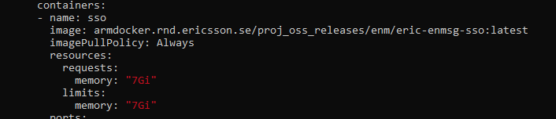

### ENM Impacts Resource Requests

On activity has already taking place is ENM on setting of resource requirements and implemented in current install base under the EPIC [TORF-365719](https://jira-oss.seli.wh.rnd.internal.ericsson.com/browse/TORF-365719). Details listed in Appendix [Resource Requests](#Resource-Requests)	

## PodDisruptionBudget

For voluntary disruptions(node drain, directly deleting a pod) Kubernetes provide PodDisruptionBudget feature to run  highly available applications during these disruptions.

An Application Owner can create a PodDisruptionBudget object (PDB) for each application. A PDB limits the number of pods of a replicated application that are down simultaneously from voluntary disruptions. For example, a quorum-based application would like to ensure that the number of replicas running is never brought below the number needed for a quorum.

So, for critical application to maintain ENM availability a PDB object should be created for that application.

PDBs cannot prevent [involuntary disruptions](https://kubernetes.io/docs/concepts/workloads/pods/disruptions/#voluntary-and-involuntary-disruptions) from occurring, but they do count against the budget.

Pods which are deleted or unavailable due to a rolling upgrade to an application do count against the disruption budget, but controllers (like deployment and stateful-set) are not limited by PDBs when doing rolling upgrades -- the handling of failures during application updates is configured in the controller spec.

The following example ensures that during a voluntary disruption(node drain, directly deleting a pod) that the neo4j PDB will only allow 1 replica to be un-available at any stage.

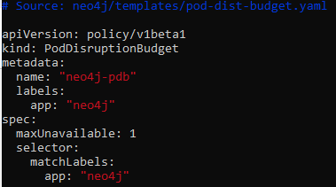

### ENM Impacts PodDisruptionBudget

It is the author recommendation that all application should include PDB.

## CustomResourceDefinition	

For a CRD, the declaration must be registered before any resources of that CRDs kind(s) can be used. And the registration process sometimes takes a few seconds.

In Helm 3 there is now a special directory called 'crds'(replacing helm2 crd-install hooks) that you can create in your chart to hold your CRDs. These CRDs are not templated, but will be installed by default when running a `helm install` for the chart. If the CRD already exists, it will be skipped with a warning. If you wish to skip the CRD installation step, you can pass the `--skip-crds` flag.

[There is not support at this time for upgrading or deleting CRDs using Helm 3](https://helm.sh/docs/topics/chart_best_practices/custom_resource_definitions/#some-caveats-and-explanations). This was an explicit decision after much community discussion due to the danger for unintentional data loss. Furthermore, there is currently no community consensus around how to handle CRDs and their lifecycle. As this evolves, Helm will add support for those use cases. 

Another way/Workaround to do this is to put the CRD definition in one chart, and then put any Custom resources that use that CRD in *another* chart and ensure that each chart must be installed separately with the CRD definition always being installed first. 

### ENM impacts CustomResourceDefinition	

For ENM it is proposed that any application using CRDS should install the CRD definition is one chart and put the Custom resources in another chart and ensure that the CRD chart is installed before the Custom Resources.

Current proposed deliverables for ENM using CRDS are:

- KLVS Router - already following this approach by putting the CRD yaml into the templates folder and the Custom Resource being installed later typically by the stateless applicaitons.
- Prometheus Operator(not yet in baseline) - Should follow the proposed approach.

## Filesystem Expansion

1. Volume Plugin expansion is available as [beta release](https://kubernetes.io/docs/concepts/storage/persistent-volumes/#expanding-persistent-volumes-claims) in kubernetes v1.11 but not all plugins support volume expansion.  CSI Volume expansion is available as [beta release](https://kubernetes-csi.github.io/docs/volume-expansion.html) in Kubernetes v1.16 and enabled by default but it also requires a specific [CSI driver to support volume expansion](https://kubernetes-csi.github.io/docs/drivers.html). 

   At the time of writing the following CSI support Expansion

   - [AWS Elastic Block System](https://github.com/kubernetes-sigs/aws-ebs-csi-driver)
   - [CephFS](https://github.com/ceph/ceph-csi)
   - [Ceph RBD](https://github.com/ceph/ceph-csi)
   - [Cinder](https://github.com/kubernetes/cloud-provider-openstack/tree/master/pkg/csi/cinder)
   - [DigitalOcean Block Storage](https://github.com/digitalocean/csi-digitalocean)
   - [HPE](https://github.com/hpe-storage/csi-driver)
   - [NetApp](https://github.com/NetApp/trident)
   - [NexentaStor](https://github.com/Nexenta/nexentastor-csi-driver)
   - [NexentaStor](https://github.com/openebs/csi)
   - [Portworx](https://github.com/libopenstorage/openstorage/tree/master/csi)
   - [QingCloud CSI](https://github.com/yunify/qingcloud-csi)
   - [SandStone](https://github.com/sandstone-storage/sandstone-csi-driver)
   - [SmartX](http://www.smartx.com/?locale=en)
   - [XSKY-EBS](https://xsky-storage.github.io/xsky-csi-driver/csi-block.html)
   - [Zadara-CSI](https://github.com/zadarastorage/zadara-csi)
   
     The up to date information is documented at [CSI Drivers](https://kubernetes-csi.github.io/docs/drivers.html?search=expansion)
   
   At the time of writing the following volume plugins support Expansion
   
   - gcePersistentDisk
   
   - awsElasticBlockStore
   
   - Cinder
   
   - glusterfs
   
   - rbd
   
   - Azure File
   
   - Azure Disk
   
   - Portworx
   
   - FlexVolumes
   
   - CSI
   
     The up to date information is documented at [Volume Plugins](https://kubernetes.io/docs/concepts/storage/persistent-volumes/#expanding-persistent-volumes-claims)
   
   To expand a PVC the storage class’s `allowVolumeExpansion` field must be set to true.
   
   You can only resize volumes containing a file system if the file system is XFS, Ext3, or Ext4(used by ENM). When a volume contains a file system, the file system is only resized when a new Pod is using the `PersistentVolumeClaim` in ReadWrite mode. File system expansion is either done when a Pod is starting up or when a Pod is running and the underlying file system supports online expansion.
   
   Resizing an in-use PersistentVolumeClaim is available as beta since Kubernetes 1.15. The `ExpandInUsePersistentVolumes` feature must be enabled, which is the case automatically for many clusters for beta features. 
   In this case, you don’t need to delete and recreate a Pod or deployment that is using an existing PVC. Any in-use PVC automatically becomes available to its Pod as soon as its file system has been expanded. This feature has no effect on PVCs that are not in use by a Pod or deployment. You must create a Pod that uses the PVC before the expansion can complete.

2. Reclaiming

   When a user is done with their volume, they can delete the PVC objects from the API that allows reclamation of the resource. The reclaim policy for a `PersistentVolume` tells the cluster what to do with the volume after it has been released of its claim. Currently, volumes can either be Retained, Recycled, or Deleted.

   Retain - The `Retain` reclaim policy allows for manual reclamation of the resource. When the `PersistentVolumeClaim` is deleted, the `PersistentVolume` still exists and the volume is considered “released”. But it is not yet available for another claim because the previous claimant’s data remains on the volume. An administrator can manually reclaim the volume

   Delete(Default) - For volume plugins that support the `Delete` reclaim policy, deletion removes both the `PersistentVolume` object from Kubernetes, as well as the associated storage asset in the external infrastructure

   

### Options Filesystem Expansion

ENM wanted position is to stay Agnostic to underlining Infrastructure.

**Note:** Ericsson NFVI will support Filesystem Expansion(Openstack Cinder)

**Options**

1. By Default ENM Over Dimensions - budgets for feature growth over the next 12-18 months where we allocate size to a filesystem, so there are no need to change the filesystem sizes sprint on sprint. 
2. Over Dimension and `only` support storage providers that support Expansion.  
3. Bespoke procedure requiring Data backup & restore or Data migration. ENM Service down time.
4. ENM Backup, Delete, Install, Restore - Full ENM outage.

### ENM Impacts Filesystem Expansion

Option 2 "Over Dimension and only support if underlining storage supports Expansion" is the selected approach.

For Storage Provider that support filesystem expansion the storage class needs to be created with "[allowVolumeExpansion=true](https://kubernetes.io/docs/concepts/storage/persistent-volumes/#expanding-persistent-volumes-claims)", and feature ExpandInUsePersistentVolumes enabled.

Currently there is on [issue](https://github.com/kubernetes/kubernetes/issues/68737#issuecomment-532238315) with Volume Expansion using the VolumeClaimTemplate(Used as part of ENM statefulsets) that is set to be fixed in 1.17 release. 

Once the fix is released the Volume expansion should happen organically as part of the ENM upgrade flow.

The Infrastructure planning guide needs to be updated to state that ENM requires “A storage provider that supports Filesystem Expansion”.

The default [Reclaim policy](https://kubernetes.io/docs/concepts/storage/persistent-volumes/#reclaiming) for Persistent volumes should be investigated as part of the filesystem expansion EPIC and recommended documented. 

## ENM 
### Models Interim Solution 

The TA "OEPTA_2019_242 Model Deployment evolution” ([OSSEPTAP-8772](https://jira-oss.seli.wh.rnd.internal.ericsson.com/browse/OSSEPTAP-8772)) will outline the cloud native solution but until complete the following updates will address the current limitations to allow parity with ENM today.

1. [CN Upgrade - modelrepo service required based on modelrepo.xml availability instead of current models container service.](https://jira-oss.seli.wh.rnd.internal.ericsson.com/browse/TORF-398317)

   **Problem Statement**: ENM implements a init container to check that the models service is registered in kubernetes when a successful run of ModelDeploymentTool has executed. In the case of upgrade when models is been upgraded the k8s service endpoint will not exist so if any dependent services restarts for some reason it will not restart until the upgrade of models is complete.

   **Solution**: Create a service that is only marked healthy when the modelrepo.xml chksum matches the chksum file(/etc/opt/ericsson/ERICmodeldeployment/data/repochecksum)  that is written by mdt on successful completion, update all services that have a dependency currently on models to check against the newly created service "modelrepo". The newly introduced service and deployment should be part of the eric-enmsg-modelserv deliverable. POC detail in jira [TORF-398317](https://jira-oss.seli.wh.rnd.internal.ericsson.com/browse/TORF-398317)

   

2. [CN Upgrade - move current models deliverable(eric-enmsg-modelserv) from Stateful integration helm chart to separate install stage](https://jira-oss.seli.wh.rnd.internal.ericsson.com/browse/TORF-403921)

   **Problem Statement**: Models is currently part of the Stateful integration helm chart and gets deployed with a number of services that have a direct dependency on models(e.g. gossip router & sps), if these services deliver a new model dependency as part of upgrade it will fail to start until the model has been deployed by MDT therefore causing the service to continually restart until the dependency is satisfied leading to service downtime.

   **Solution**: As already discussed in the [General Overview](#General-Overview) the upgrade will be ran in a staged manner and moving models into a stage prior to the Stateful & Stateless integration chart will ensure that the dependency will always be satisfied before any of the dependent software is upgraded. Helm chart eric-enmsg-modelserv has 2 dependencies on 2 other charts in stateless stage, eric-enm-globalproperties & eric-enm-rwxpvc. eric-enm-globalproperties can move to the Platform integration chart, pvc's that have a natural owner(like mdt pvc) should move to the applicaton helm chart with the remainder moving to the Platform integration chart.  POC details in [TORF-403921](https://jira-oss.seli.wh.rnd.internal.ericsson.com/browse/TORF-403921)

   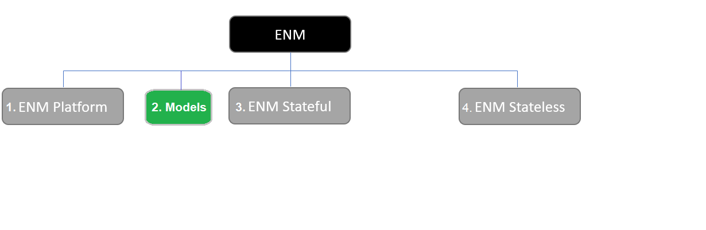

### Integration Chart Deployments and Statefulsets

Traditionally ENM will upgrade all its stateful applications before upgrading its stateless application. Helm reverses this order so a install/upgrade of a Deployment(usually stateless) will have priority over a Statefulset

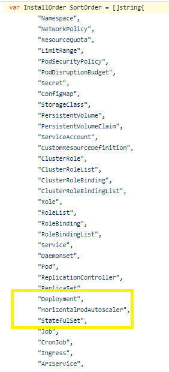

Currently ENM has a number application running as StatefulSet(sso & haproxy) as part of the stateless integration chart. 

Interim proposal is to move the above application running as kubernetes Statefulset into the Stateful integration chart so all kubernetes StatefulSet & Deployment will be group together and install/upgrade initiated at the same time. The medium terem solution is to move these from Statefulsets to Deployments.

Cloud Native ENM should also align with "Small Openstack ENM" deployment [install order](https://gerrit.ericsson.se/plugins/gitiles/OSS/com.ericsson.oss.itpf.deployment/enm-cloudtemplates/+/refs/heads/master/enm.json)

Looking at current install sps should move from the stateless integration chart to the stateful integration chart. 

### ENM Upgrade times

Cloud Native ENM upgrade time will be comparable with "Small ENM on Openstack". The upgrade flow for Cloud Native ENM follows a similar pattern(Rolling over Strategy) to that of "Small ENM on Openstack".

Referring to the [ENM system Capacity](https://erilink.ericsson.se/eridoc/erl/objectId/09004cffc3320b96?docno=3/1555-AOM901151Uen&format=pdf) , the requirement is  “3.5 hours for SW upgrade.” 

There should be slight improvements in start up times of POD compared to that of Virtual Machines(No need to boot VM host OS)

The TA "OEPTA_2019_242 Model Deployment evolution” ([OSSEPTAP-8772](https://jira-oss.seli.wh.rnd.internal.ericsson.com/browse/OSSEPTAP-8772)) when delivered should also deliver time improvements over current modelling solution

## Upgrade - New Software added to existing Release

New software added to the integration helm chart will follow the same [install order](https://github.com/helm/helm/blob/release-2.16/pkg/tiller/kind_sorter.go#L29) as all other software in the helm chart and will have no impact on proposed upgrade solution.

## Upgrade - Remove Software/Helm Chart

Removal of software can be disabled thru the outer [integration values](https://gerrit.ericsson.se/plugins/gitiles/OSS/com.ericsson.oss.containerisation/eric-enm-integration/+/refs/heads/master/eric-enm-integration-values/eric-enm-integration-values.yaml) by setting the helm chart of the application you want to remove to false(see "Initial Install, Product and Application CSAR structure" [Ref [1]](#References)).

Once set to false software will be removed as part of the Helm Release upgrade.

## Documentation

### Upgrade Documentation

- An upgrade document is required to step the end-user thru the procedure to Upgrade SW and provide any troubleshooting steps if needed.

  It should follow a similar flow to below, Note this is a non-exhaustive list

  1.  Check/Run any pre-requisites.
  2.  Software placed on Helm Client & Docker registry

      -   Helm Charts copied to Helm Client

      -   Images Tag & Push images to Docker Registry

      -   Site Engineering File copied to Helm Client
  3.  Verify current Helm release is stable.
  4.  Call backup procedure.
  5.  Run upgrade via 3 helm integration chart commands.
  6.  Verify upgraded Helm release is stable.
  7.  Remove backup if satisfied or call Rollback procedure.
  8.  Any Post-upgrade steps if required.
  9.  Troubleshooting Section.

- Upgrade document should include a note that ENM implements Kubernetes PodDisruptionBudget for all applications through helm charts which allows Kubernetes to run highly available applications during voluntary disruptions(i.e. node drain, directly deleting a pod).

  The default Container Platform cluster upgrade is [one node at a time](https://kubernetes.io/docs/tasks/administer-cluster/kubeadm/kubeadm-upgrade/#upgrade-worker-nodes) and will drain the nodes which will prepare the node for maintenance by marking it unschedulable and evicting the workloads. ENM workloads will drain for the node that is to be upgraded and the Kubernetes scheduler will then schedule the workload on a worker node that has free resources. If the application is single instance there will be downtime as its switches nodes. 

  Container Platform Release Note should be reviewed to see if any "Breaking Changes" have been introduced between releases.

  If the infrastructure is upgraded in a rolling over upgrade manner which causes voluntary disruption(node drain, directly deleting a pod) the impacts are the same as default Container Platform Upgrade.

  

### Infrastructure Planning Guide

- Between software releases of ENM there may be need for additonal resources(i.e new applications, new volumes), any updates to the resource requirements between releases should be captured in the "Infrastructure Planning Guide” Release on Release.
- For Pod anti-affinity requires nodes to be consistently labelled, i.e. every node in the cluster must have an appropriate label matching topologyKey. If some or all nodes are missing the specified topologyKey label, it can lead to unintended behavior. Required label is **kubernetes.io/hostname**
- For Storage Provider that support filesystem expansion the storage class needs to be created with "[allowVolumeExpansion=true](https://kubernetes.io/docs/concepts/storage/persistent-volumes/#expanding-persistent-volumes-claims)", and feature ExpandInUsePersistentVolumes enabled.
- The default [Reclaim policy](https://kubernetes.io/docs/concepts/storage/persistent-volumes/#reclaiming) for Persistent volume should be investigated as part of the filesystem expansion work and default documented. Default kubernetes policy is "Delete".
-  ENM requires “A storage provider that supports Filesystem Expansion”.

### Verify Helm Release

The following is a list of checks to ensure applications are healthy, note this is a non-exhaustive list:

-   Check deployments are healthy

-   Check statefulsets are healthy

-   Check daemonsets are healthy

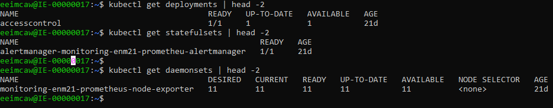

### Failed Upgrade Fix Forward

If a Helm release fails and it is possible to troubleshoot and fix the issue on site, it is then possible to continue the upgrade by re-issuing the same helm command. This should be part of a troubleshooting section in the Upgrade Documentation.

## Automated Install and Logging	

Where possible the steps outlined in [Upgrade Document](#Documentation) should be automated.

Long term goal is to use the Orchestrator being studied as part of [TA OEPTA_2019_193 Analysis of BDGS Application Manager](https://jira-oss.seli.wh.rnd.internal.ericsson.com/browse/OSSEPTAP-8635).

Until the above TA is complete, there are 2 alternatives to re-use work already done in this area. 

The Author recommendation is to use Alternative 1 and could be used across the OSS portfolio. This ties in with the current TA where it is proposed to include the "EO deployer image" as a common service under Application Manager.

### Alternative 1 EO deployer Image

EO are currently developing a docker image that simplifies the number of install steps required in the documentation. It currently includes the python library for docker and kubectl plus the helm 2 binary which much match the version of tiller installed by ECCD. In coming sprint CCD will move to helm3 removing the tight coupling to ECCD.

The docker image will unpack the CSAR, retag and push the docker images, run the helm install/upgrade commands against the provided Integration Charts. The deployer image will also provide some support for the use of helm3 json validation schema of the values.yaml.

Current work on the deployer image is being covered under Epic [SM-31511](https://jira-oss.seli.wh.rnd.internal.ericsson.com/browse/SM-31511).

Investigation required to deliver this as a "Common OSS product" and make all features common so can be used across the portfolio.

### Alternative 2 ESON Scripts

ESON have a number of scripts delivered as part of the ESON CSAR that are used to retag and load docker images as well as installing and upgrading integration helm charts. List of scripts available in ESON:

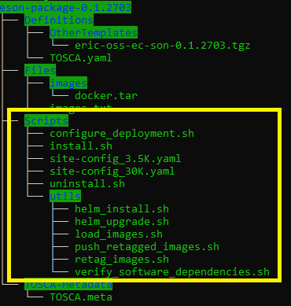

These script could be updated and re-used for ENM and could be delivered as common scripts that can be used across the portfolio and become the default installation procedure.

### Logging and DDP

The install & upgrades procedure should log to file in a machine parseable format making it easier for DDP and other monitoring tools to display(Any story on format should include DDP team).  At end of the installation the log file should be placed on the ddcdata rwx persistent volume so can be included and uploaded to DDP.  This can be realized by running a short lived container that mounts the ddcdata share and copies the log file at the end of upgrade.

Today DDP displays a Upgrade Summary with a list of stages, duration and start and end time. Similar information should be available for cENM upgrades where DDP will parse the log to get this information. For example all integration charts should be a stage and should be presented in DDP.

In physical there is a [enm_version](https://gerrit.ericsson.se/plugins/gitiles/OSS/com.ericsson.itpf.deployment/ENM_INST/+/refs/heads/master/ERICenminst_CXP9030877/src/main/bin/enm_version.sh) file created that contains the software level of the ENM deployment. At install/upgrade the scripts could interrogate the Helm Charts to build up a similar picture for cloud native of the released helm charts and docker images that can be uploaded to DDP.

## Known Issues

### Helm 3 Open Issues

1. https://github.com/helm/helm/issues/6850 Unable to perform helm upgrade due to resource conflict when apiVersion Changed. Workaround is to upgrade via kubectl until Helm fix is released. Workaround is not a valid option for ENM so require fix or re-enable old api's if in use.

   

# Verification Strategy

- To ensure ENM is agnostic to the underlining Container platform Upgrade testing should be verified on atleast 2 platform, ECCD plus one other.

  - Platform upgrade should be tested on these platforms making sure ENM availability is maintained when supported by the underlining platform(ie no "Breaking Changes" between platform releases, check [Release note(s)](https://github.com/kubernetes/kubernetes/blob/master/CHANGELOG)). ENM and platform upgrades should not be run in parallel.

- There will be test impacts on the ADU suites ran for ENM, EPICS in place

  - [Robustness](https://jira-oss.seli.wh.rnd.internal.ericsson.com/browse/RTD-11434)
  - [Availability](https://jira-oss.seli.wh.rnd.internal.ericsson.com/browse/RTD-11007)

  

# Strategic Consideration

Strategic approach:

-   Reuse of software

    -   Take ADP common services to replace existing ENM services where applicable
-   Agnostics to Infrastructure

# Summary of Requirement

N/A

# Benefit and Value of feature

N/A

# Technical Debt/Improvements considered

N/A

# Alternative Approaches Considered

N/A

# Input for further studies

N/A

# Costs

| Epics/Chapters                                               | Estimates          | Comment                                                      |
| ------------------------------------------------------------ | ------------------ | ------------------------------------------------------------ |
| [ENM impacts UpdateStrategy Deployment](#ENM-impacts-UpdateStrategy-Deployment) [ENM impacts UpdateStrategy StatefulSet](#ENM-impacts-UpdateStrategy-StatefulSet) [ENM impacts CustomResourceDefinition](#ENM-impacts-CustomResourceDefinition) | 4 people/1 sprint  | Helm Chart updates, requires Library charts implementation to simplify updates |
| [ENM Impacts Graceful Termination & Lifecycle Hooks](#ENM-Impacts-Graceful-Termination-and-Lifecycle-Hooks) | 3 people/1 sprint  |                                                              |
| [ENM impacts PodAntiAffinity](#ENM-impacts-PodAntiAffinity)  | 3 people/1 sprint  | Helm Chart updates, requires Library charts implementation to simplify updates |
| [ENM Impacts PodDisruptionBudget](#ENM-Impacts-PodDisruptionBudget) | 3 people/1 sprint  | Helm Chart updates, requires Library charts implementation to simplify updates |
| [Documentation](#Documentation)                              | 2 people/1 sprint  | Document should follow common format across OSS portfolio.   |
| [Automated install & logging](#Automated-Install-and-Logging) | 4 people/1 sprints | Investigate re-use of EO Deployer image                      |
| [Models Interim Solution](#Models-Interim-Solution) [Integration Chart Deployments and Statefulsets](#Integration-Chart-Deployments-and-Statefulsets) | 2 people/1 sprints | ENM Specifics.                                               |
| [ENM Impacts Filesystem Expansion](#ENM-Impacts-Filesystem-Expansion) | 3 people/1 sprints |                                                              |
| Total                                                        | 24 people/1 sprint | Experienced Deployment Team.                                 |

# Glossary

## Terms and Definitions

## Acronyms and Abbreviations

| Acronym | Description                           |
| ------- | ------------------------------------- |
| ADP     | Application Development Platform      |
| ECCD    | Ericsson Cloud Container Distribution |
| K8s     | Kubernetes                            |
| PDB     | PodDisruptionBudget                   |
| VM      | Virtual Machine                       |
| LCM     | Life Cycle Manager                    |
| CSI     | Container Storage Interface           |

## References

\[1\] [Initial Install, Product and Application CSAR structure, Software Delivery](https://erilink.ericsson.se/eridoc/erl/objectId/09004cffc2d3ecad?docno=BDGS-19:006499Uen&action=current&format=msw12)

# Appendix

## Resource Requests	

This page will gives memory limits analysis on SGs for Cloud Native Deployments in KaaS and Openstack Cluster deployments.

The default values in the below table are based on 5k physical ENM deployment. 

But with these default memory limit values design teams are not able to deploy more than one cENM deployments on hoff clusters due to limited memory on the clusters.

And also Integration team is unable to integrate more SGs on to the deployment due to out of memory issues on the KaaS environments.

Some analysis has been done based on maximum memory utilizing at the time Installation and stable deployment after installation and provided some optimized memory limits for each SG in the below table.

There is a possible way to update the resources via the integration-values.yaml without changing the applications charts. The separate integration-values.yaml template will be created for design teams for II on KaaS environments. 

For any new SG implementations, design teams has to check the maximum utilization at the time of installation and stable deployment using the 'kubectl top <pod>' command and update the limits and requests in the design integration-values.yaml file.

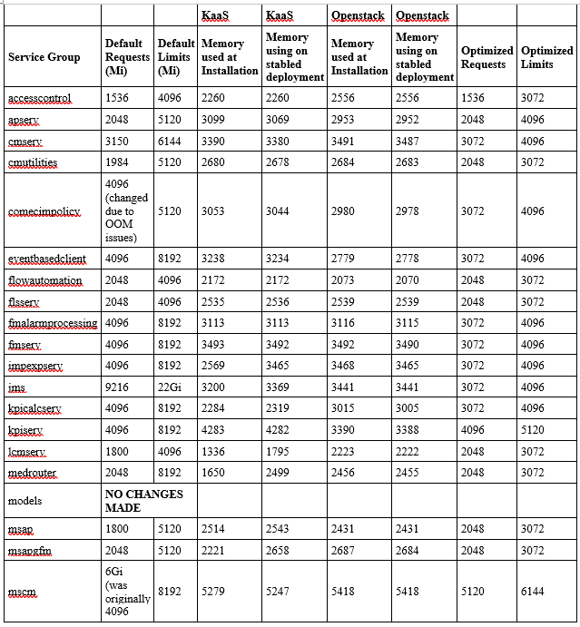
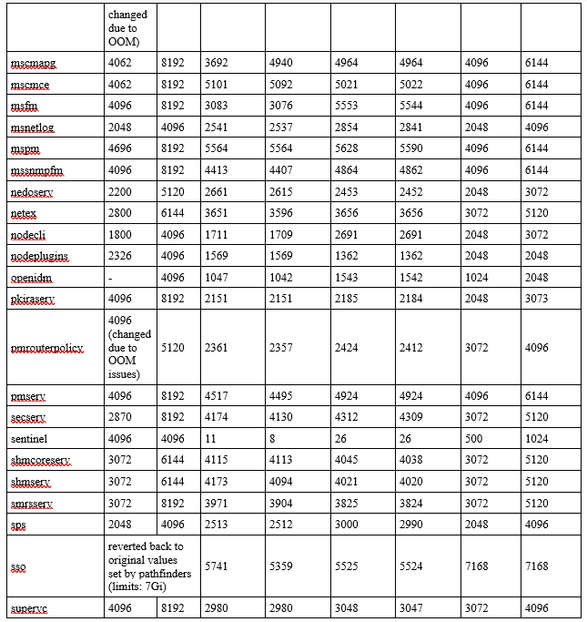
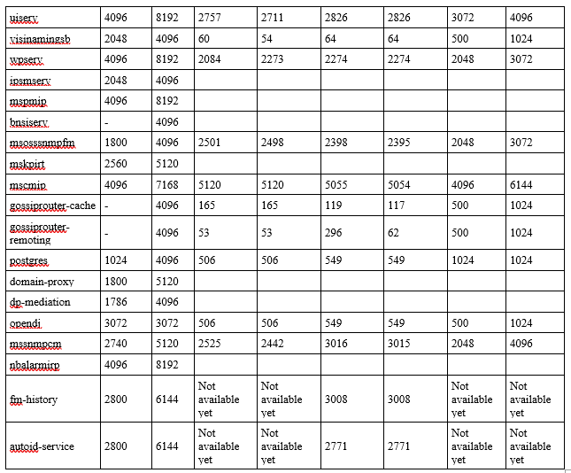

## Kubernetes Cluster Upgrade

Upgrade of Kubernetes Cluster is "Out of Scope" in this Technical Report.

Procedure for upgrading a kubernetes cluster using kubeadm is available at [kubernetes documentation](https://kubernetes.io/docs/tasks/administer-cluster/kubeadm/kubeadm-upgrade/)

kubeadm is one tool available used to deploy a kubernetes cluster and is currently used by ECCD. Other tools and services exist that perform similar functions like kubespray, kops, Amazon EKS etc.

Key takeaway on upgrading kubernetes cluster:

- You only can upgrade from one MINOR version to the next MINOR version, or between PATCH versions of the same MINOR. That is, you cannot skip MINOR versions when you upgrade. For example, you can upgrade from 1.y to 1.y+1, but not from 1.y to 1.y+2.
- The default upgrade procedure on worker nodes is to execute one node at a time, without compromising the minimum required capacity for running your workloads.
- Kubernetes [Release note](https://github.com/kubernetes/kubernetes/tree/master/CHANGELOG) should be read carefully and checked for any "Breaking Changes"(e.g. breaking api change). With each introduction of new platform release, New MR for ENM is required to analyze impacts(same procedure exist today for ENM Openstack)
- ENM will implement Kubernetes PodDisruptionBudget for all applications through helm charts which allows kubernetes to run highly available applications during voluntary disruptions(i.e. node drain, directly deleting a pod).